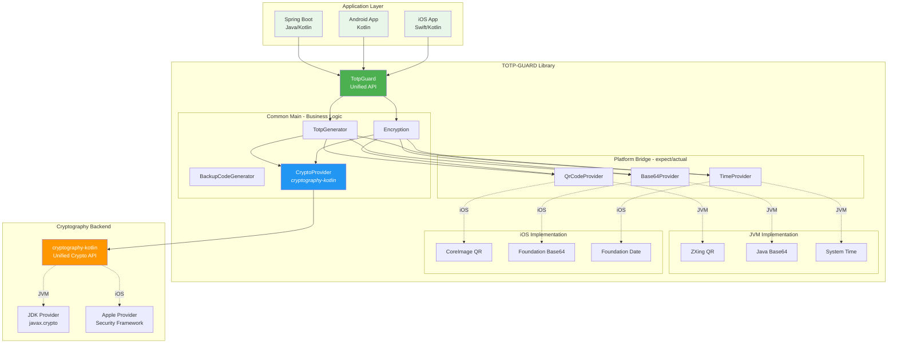
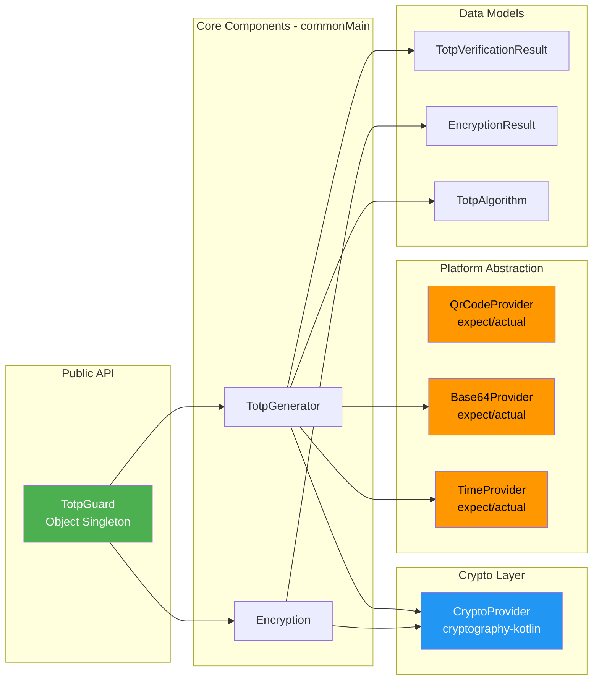
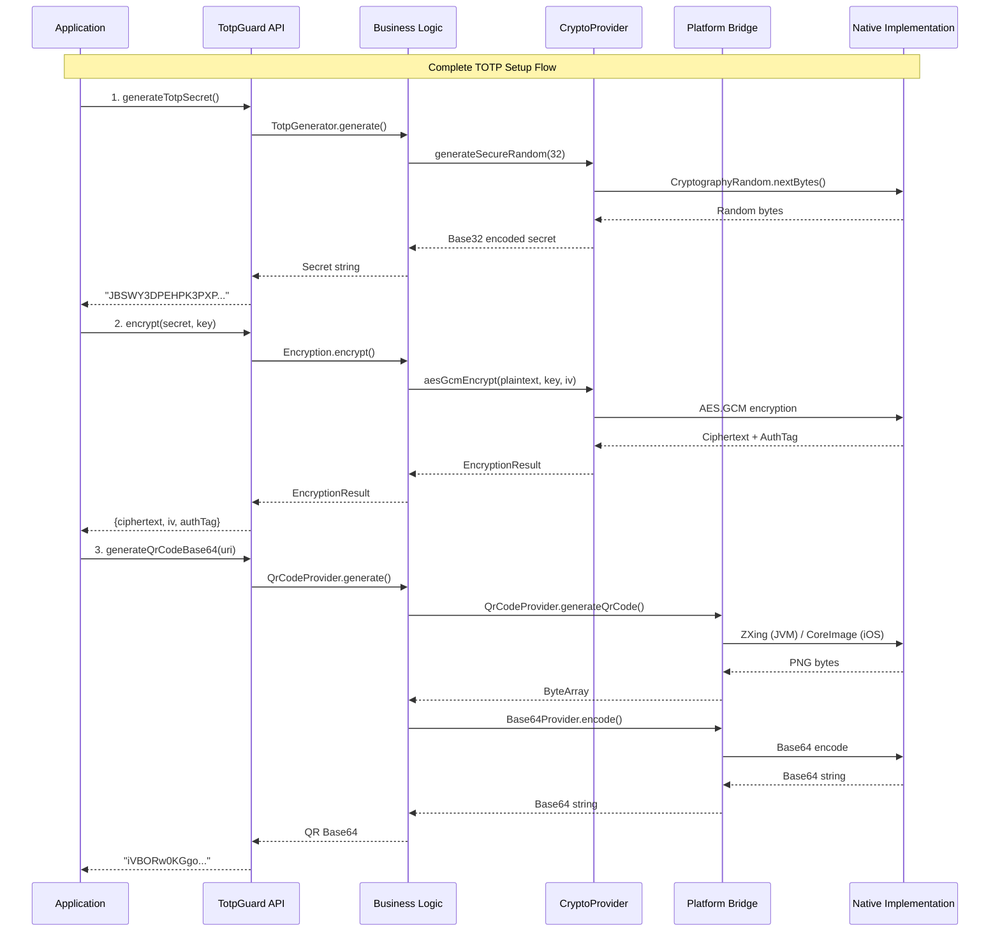
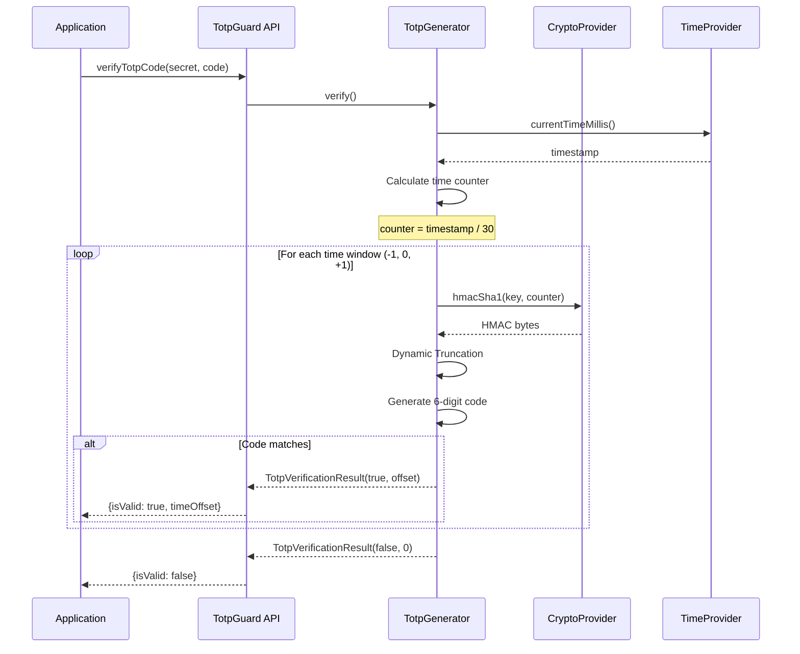
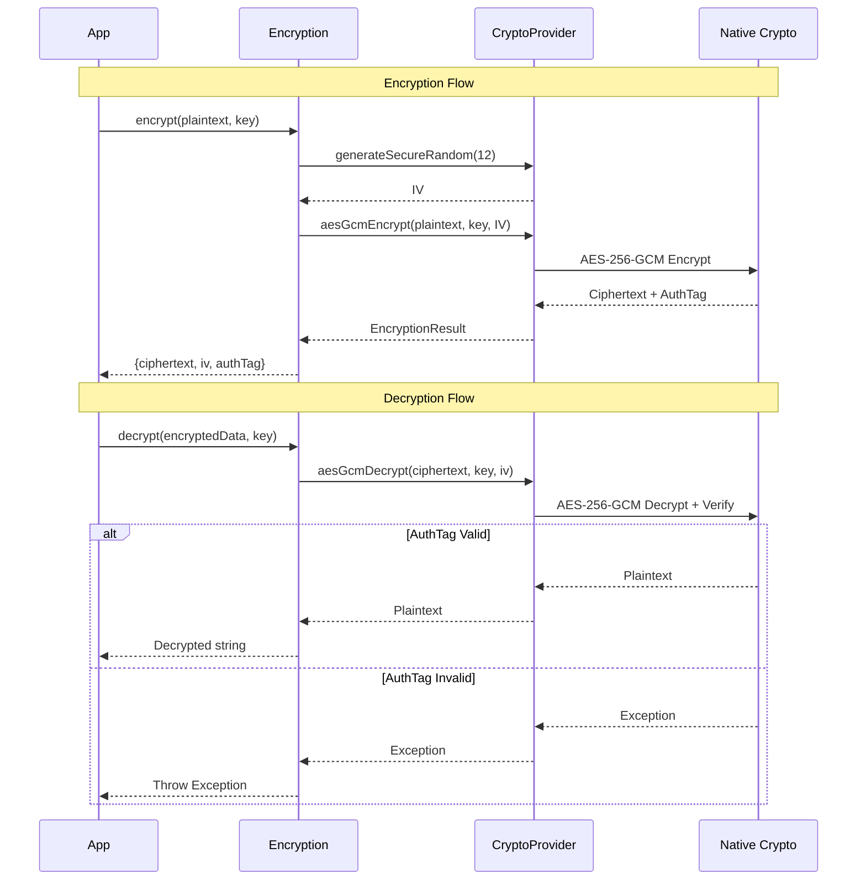
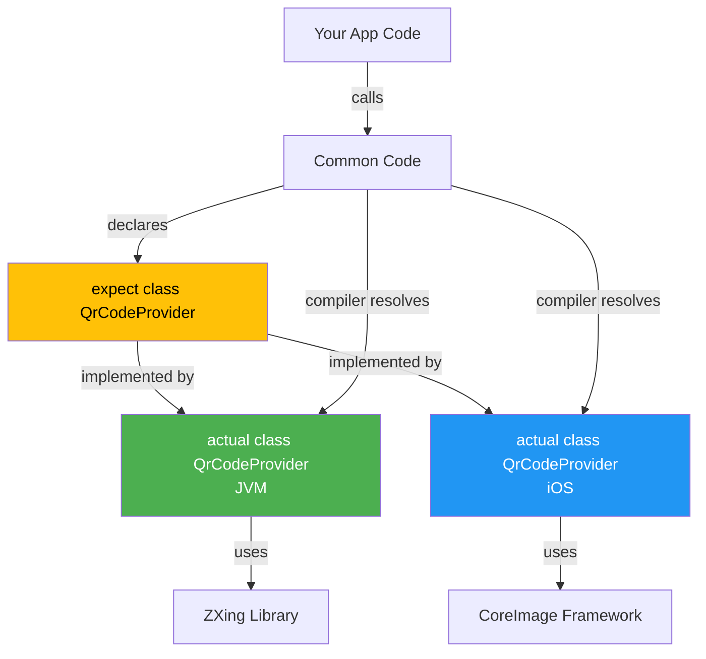
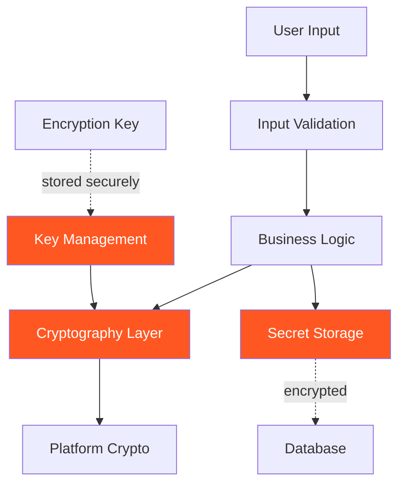

# TOTP-GUARD Architecture Documentation

## 📐 Arsitektur Multiplatform Bridge

Dokumen ini menjelaskan arsitektur internal library TOTP-GUARD yang menggunakan Kotlin Multiplatform dengan bridge pattern untuk menyediakan API yang konsisten di berbagai platform.

---

## 1. Overview Arsitektur

### High-Level Architecture



---

## 2. Layer Architecture

### 2.1 Application Layer
Konsumen library dari berbagai platform:
- **Spring Boot**: Backend server (JVM)
- **Android**: Mobile app (JVM/Android)
- **iOS**: Mobile app (iOS/Native)

### 2.2 API Layer (`TotpGuard`)
- Single object singleton sebagai entry point
- API yang sama untuk semua platform
- Menyembunyikan kompleksitas implementasi

#### 3️⃣ **Common Main** (Business Logic)
- **TotpGenerator**: RFC 6238 TOTP implementation
- **Encryption**: AES-256-GCM encryption/decryption
- **CryptoProvider**: Unified cryptography operations

### 2.4 Platform Abstraction Layer (expect/actual)
Bridge untuk platform-specific implementations:
- **QrCodeProvider**: QR code generation
- **Base64Provider**: Base64 encoding/decoding
- **TimeProvider**: System time access

### 2.5 Platform Implementation Layer
Native implementations per platform:
- **JVM**: ZXing, Java stdlib
- **iOS**: CoreImage, Foundation

### 2.6 Cryptography Layer
Modern unified crypto using cryptography-kotlin:
- Automatic platform provider selection
- Consistent API across platforms
- Secure by default

---

## 3. Component Dependency Diagram



---

## 4. Data Flow Diagrams

### 4.1 TOTP Setup Flow



### 4.2 TOTP Verification Flow



### 4.3 Encryption/Decryption Flow



---

## 5. expect/actual Pattern Implementation

### 5.1 Concept



### 5.2 Code Example

**commonMain/platform/QrCodeProvider.kt:**
```kotlin
expect class QrCodeProvider() {
    fun generateQrCode(content: String, size: Int): ByteArray
}
```

**jvmMain/platform/QrCodeProvider.kt:**
```kotlin
actual class QrCodeProvider {
    actual fun generateQrCode(content: String, size: Int): ByteArray {
        val writer = QRCodeWriter()
        val bitMatrix = writer.encode(content, BarcodeFormat.QR_CODE, size, size)
        return MatrixToImageWriter.toBufferedImage(bitMatrix).toByteArray()
    }
}
```

**iosMain/platform/QrCodeProvider.kt:**
```kotlin
actual class QrCodeProvider {
    actual fun generateQrCode(content: String, size: Int): ByteArray {
        val filter = CIFilter.filterWithName("CIQRCodeGenerator")!!
        filter.setValue(content.toNSData(), "inputMessage")
        val cgImage = CIContext().createCGImage(filter.outputImage!!)
        return UIImagePNGRepresentation(UIImage.imageWithCGImage(cgImage))!!
    }
}
```

---

## 6. Technology Stack Matrix

| Komponen | JVM Platform | iOS Platform | Common |
|----------|--------------|--------------|--------|
| **Crypto (HMAC/AES)** | cryptography-kotlin<br/>→ JDK Provider<br/>→ javax.crypto | cryptography-kotlin<br/>→ Apple Provider<br/>→ Security Framework | ✅ Unified API |
| **QR Code** | ZXing Core<br/>ZXing JavaSE | CoreImage<br/>CIFilter | expect/actual |
| **Base64** | java.util.Base64 | Foundation<br/>Data.base64EncodedString() | expect/actual |
| **Time** | System.currentTimeMillis() | Date().timeIntervalSince1970 | expect/actual |
| **Random** | cryptography-kotlin<br/>CryptographyRandom | cryptography-kotlin<br/>CryptographyRandom | ✅ Unified API |

---

## 7. Evolution: Manual → cryptography-kotlin

### 7.1 Before (v0.0.0)

```kotlin
// Manual expect/actual untuk crypto
// commonMain
expect class CryptoProvider {
    fun hmacSha1(key: ByteArray, data: ByteArray): ByteArray
    fun aesGcmEncrypt(plaintext: ByteArray, key: ByteArray, iv: ByteArray): ByteArray
}

// jvmMain - 100 lines
actual class CryptoProvider {
    actual fun hmacSha1(key: ByteArray, data: ByteArray): ByteArray {
        val mac = Mac.getInstance("HmacSHA1")
        val secretKey = SecretKeySpec(key, "HmacSHA1")
        mac.init(secretKey)
        return mac.doFinal(data)
    }
    // ... more JVM-specific code
}

// iosMain - 140 lines
actual class CryptoProvider {
    actual fun hmacSha1(key: ByteArray, data: ByteArray): ByteArray {
        val algorithm = CCHmacAlgorithm.kCCHmacAlgSHA1
        val result = ByteArray(CC_SHA1_DIGEST_LENGTH)
        CCHmac(algorithm, key, key.size, data, data.size, result)
        return result
    }
    // ... more iOS-specific code
}
```

**Issues:**
- ❌ Code duplication (~240 lines total)
- ❌ Maintain 2 implementations
- ❌ Risk of platform-specific bugs
- ❌ Different APIs per platform

### 7.2 After (v0.0.1-beta)

```kotlin
// Unified implementation using cryptography-kotlin
// commonMain only - 100 lines
@OptIn(DelicateCryptographyApi::class)
class CryptoProvider {
    private val provider = CryptographyProvider.Default
    
    suspend fun hmacSha1(key: ByteArray, data: ByteArray): ByteArray {
        val hmac = provider.get(HMAC).keyDecoder(SHA1)
            .decodeFromByteArray(HMAC.Key.Format.RAW, key)
        return hmac.signatureGenerator().generateSignature(data)
    }
    
    suspend fun aesGcmEncrypt(plaintext: ByteArray, key: ByteArray, iv: ByteArray): ByteArray {
        val aes = provider.get(AES.GCM).keyDecoder()
            .decodeFromByteArray(AES.Key.Format.RAW, key)
        return aes.cipher().encrypt(plaintext, iv)
    }
}
```

**Benefits:**
- ✅ Single implementation (~100 lines total)
- ✅ Reduced code by 58%
- ✅ One place to maintain
- ✅ Same API across all platforms
- ✅ cryptography-kotlin handles platform differences
- ✅ Easy to add new platforms

---

## 8. File Structure

```
library/src/
├── commonMain/kotlin/io/github/aribrilliantsyah/totpguard/
│   ├── TotpGuard.kt                    # 🎯 Main API
│   ├── auth/
│   │   └── TotpGenerator.kt            # 🔐 TOTP Logic
│   ├── crypto/
│   │   └── Encryption.kt               # 🔒 AES Encryption
│   ├── platform/
│   │   ├── CryptoProvider.kt           # ✨ Unified Crypto
│   │   ├── QrCodeProvider.kt           # 📱 expect
│   │   ├── Base64Provider.kt           # 📝 expect
│   │   └── TimeProvider.kt             # ⏰ expect
│   ├── model/
│   │   ├── TotpAlgorithm.kt
│   │   ├── TotpVerificationResult.kt
│   │   └── EncryptionResult.kt
│   └── util/
│       └── Base32.kt
│
├── jvmMain/kotlin/.../platform/
│   ├── QrCodeProvider.kt                # actual: ZXing
│   ├── Base64Provider.kt                # actual: Java
│   └── TimeProvider.kt                  # actual: System
│
└── iosMain/kotlin/.../platform/
    ├── QrCodeProvider.kt                # actual: CoreImage
    ├── Base64Provider.kt                # actual: Foundation
    └── TimeProvider.kt                  # actual: Date
```

---

## 9. Design Principles

### 9.1 Separation of Concerns
- **API Layer**: User-facing interface
- **Business Logic**: Platform-independent algorithms
- **Platform Abstraction**: Bridge to native implementations
- **Native Implementations**: Platform-optimized code

### 9.2 DRY (Don't Repeat Yourself)
- Shared business logic in commonMain
- Platform-specific code only when necessary
- Prefer unified implementations (cryptography-kotlin)

### 9.3 Open/Closed Principle
- Easy to add new platforms without changing existing code
- expect/actual allows platform extension

### 9.4 Dependency Inversion
- High-level modules depend on abstractions (expect)
- Low-level modules implement abstractions (actual)

### 9.5 Single Responsibility
- Each class has one clear purpose
- TotpGuard delegates to specialized components

---

## 10. Adding New Platforms

To add a new platform (e.g., Android, JS, Native):

1. **Add target to build.gradle.kts:**
```kotlin
kotlin {
    jvm()
    ios()
    android()  // New platform
}
```

2. **Create platform source set:**
```
mkdir -p library/src/androidMain/kotlin/io/github/aribrilliantsyah/totpguard/platform
```

3. **Implement actual classes:**
```kotlin
// androidMain/platform/QrCodeProvider.kt
actual class QrCodeProvider {
    actual fun generateQrCode(content: String, size: Int): ByteArray {
        // Android-specific implementation using ZXing Android
    }
}
```

4. **Add platform dependencies:**
```kotlin
sourceSets {
    val androidMain by getting {
        dependencies {
            implementation("com.google.zxing:core:3.5.3")
            // ... other Android-specific deps
        }
    }
}
```

5. **Test and publish!**

The beauty of this architecture: CryptoProvider works automatically on the new platform thanks to cryptography-kotlin!

---

## 11. Performance Considerations

### Crypto Operations
- **cryptography-kotlin** uses native implementations:
  - JVM: Hardware-accelerated AES via JCA
  - iOS: Hardware-accelerated via Security Framework
- Suspend functions allow non-blocking operations
- runBlocking wrapper maintains synchronous API

### QR Code Generation
- Generated once during setup
- Cached by application if needed
- Size configurable (default 300x300)

### TOTP Verification
- Fast: Only 3 HMAC calculations (time window ±1)
- No network calls required
- Constant-time comparison for security

---

## 12. Security Architecture

### Defense in Depth



### Security Features
- ✅ AES-256-GCM authenticated encryption
- ✅ Secure random number generation
- ✅ BCrypt for backup code hashing
- ✅ Time-based code expiration
- ✅ No secrets in plaintext
- ✅ Platform-native crypto backends

---

## Conclusion

This architecture provides:
- **Consistency**: Same API across all platforms
- **Performance**: Native implementations where it matters
- **Maintainability**: Shared code, minimal duplication
- **Security**: Best-practice crypto implementations
- **Extensibility**: Easy to add new platforms

The combination of Kotlin Multiplatform, expect/actual pattern, and cryptography-kotlin creates a robust, maintainable, and secure foundation for TOTP authentication across platforms.
