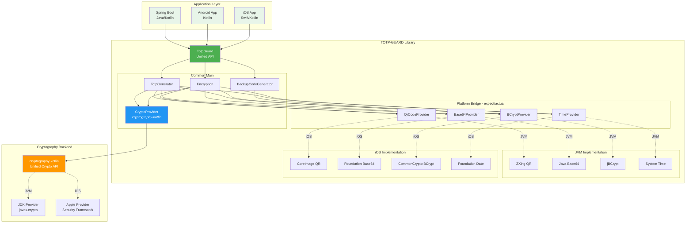
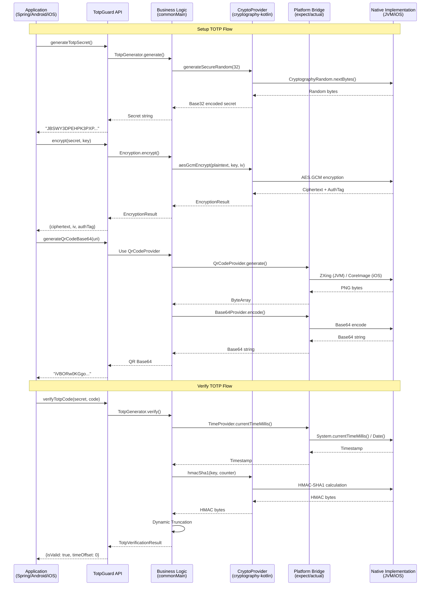
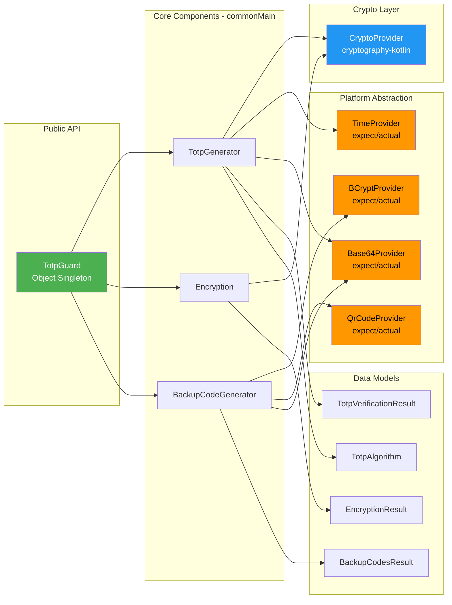
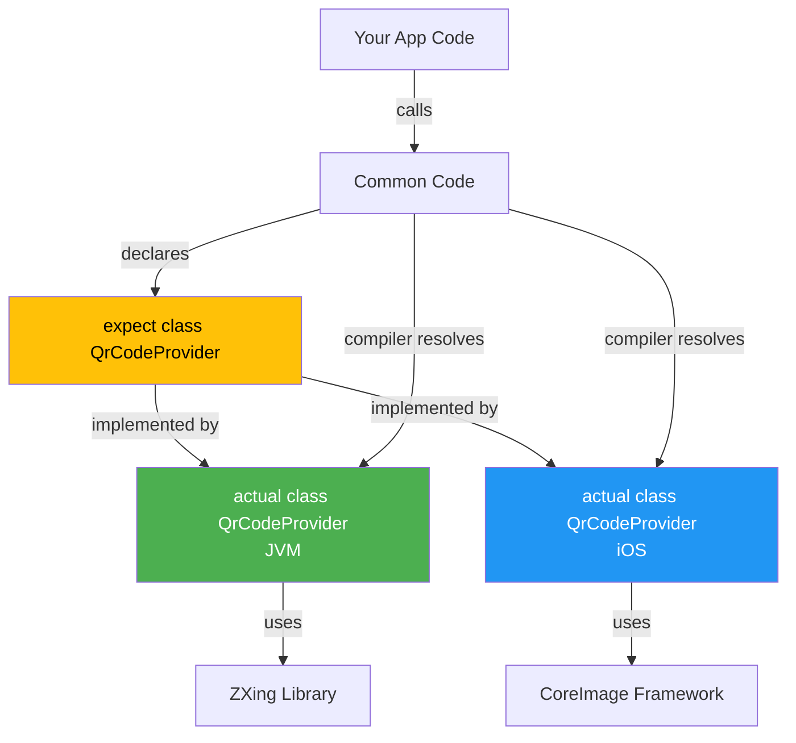

# TOTP-GUARD

TOTP-GUARD adalah library Kotlin Multiplatform (KMP) untuk autentikasi TOTP (Time-based One-Time Password), enkripsi, pembuatan kode QR, dan manajemen kode cadangan. Library ini dirancang untuk mudah digunakan dalam aplikasi Spring Boot, Android, dan iOS dengan implementasi cryptography yang unified menggunakan **cryptography-kotlin**.

[](https://opensource.org/licenses/Apache-2.0)
[](https://search.maven.org/artifact/io.github.aribrilliantsyah/totp-guard)
[](https://github.com/aribrilliantsyah/totpguard/releases)
[](http://kotlinlang.org)
[](https://www.oracle.com/java/technologies/javase/jdk11-archive-downloads.html)

## 🏗️ Arsitektur Multiplatform

Library ini menggunakan arsitektur Kotlin Multiplatform dengan **bridge pattern** untuk menyediakan API yang konsisten di semua platform sambil memanfaatkan implementasi native platform untuk performa optimal.

### Diagram Arsitektur



### Penjelasan Arsitektur

#### 1️⃣ **Application Layer** (Konsumen Library)
   - **Spring Boot**: Backend server menggunakan Java atau Kotlin
   - **Android**: Aplikasi mobile Android native
   - **iOS**: Aplikasi mobile iOS (Swift dengan Kotlin Framework)

#### 2️⃣ **Unified API** (`TotpGuard`)
   - Single entry point untuk semua fitur
   - API yang sama untuk semua platform
   - Menyembunyikan kompleksitas platform-specific

#### 3️⃣ **Common Main** (Business Logic)
   - **TotpGenerator**: Logika TOTP (RFC 6238)
   - **Encryption**: AES-256-GCM encryption/decryption
   - **BackupCodeGenerator**: Generate dan verify backup codes
   - **CryptoProvider**: ✨ **Unified crypto menggunakan cryptography-kotlin**

#### 4️⃣ **Platform Bridge** (expect/actual pattern)
   Komponen yang memerlukan implementasi platform-specific:
   - **QrCodeProvider**: QR Code generation
   - **Base64Provider**: Base64 encoding/decoding
   - **BCryptProvider**: BCrypt hashing untuk backup codes
   - **TimeProvider**: System time untuk TOTP

#### 5️⃣ **Platform Implementations**
   
   **JVM Platform:**
   - ZXing untuk QR Code
   - Java Base64 standard library
   - jBCrypt untuk password hashing
   - System.currentTimeMillis()

   **iOS Platform:**
   - CoreImage untuk QR Code
   - Foundation Base64
   - CommonCrypto untuk BCrypt
   - Date().timeIntervalSince1970

#### 6️⃣ **Cryptography Backend** ✨ **New Unified Approach**
   - **cryptography-kotlin**: Modern multiplatform crypto library
   - Otomatis memilih provider sesuai platform:
     - JVM → JDK Provider (javax.crypto)
     - iOS → Apple Provider (Security Framework, CommonCrypto)
   - Menyediakan API yang konsisten untuk HMAC dan AES-GCM

### Keuntungan Arsitektur Bridge

✅ **Write Once, Run Everywhere**: Logika bisnis ditulis sekali di commonMain  
✅ **Platform Optimization**: Memanfaatkan native library untuk performa terbaik  
✅ **Type Safety**: Compiler memastikan semua platform memiliki implementasi  
✅ **Easy Maintenance**: Perubahan di common code otomatis berlaku untuk semua platform  
✅ **Testability**: Business logic dapat ditest secara independen  
✅ **Unified Crypto**: cryptography-kotlin menyediakan API yang sama untuk semua platform

### Data Flow Diagram



### Teknologi Stack per Platform

| Komponen | JVM Platform | iOS Platform | Common |
|----------|--------------|--------------|--------|
| **Crypto (HMAC/AES)** | cryptography-kotlin<br/>→ JDK Provider<br/>→ javax.crypto | cryptography-kotlin<br/>→ Apple Provider<br/>→ Security Framework | ✅ Unified API |
| **QR Code** | ZXing Core<br/>ZXing JavaSE | CoreImage<br/>CIFilter | expect/actual |
| **Base64** | java.util.Base64 | Foundation<br/>Data.base64EncodedString() | expect/actual |
| **BCrypt** | jBCrypt | CommonCrypto<br/>CCKeyDerivation | expect/actual |
| **Time** | System.currentTimeMillis() | Date().timeIntervalSince1970 | expect/actual |
| **Random** | cryptography-kotlin<br/>CryptographyRandom | cryptography-kotlin<br/>CryptographyRandom | ✅ Unified API |

### Migration dari Manual Implementation ke cryptography-kotlin

Sebelumnya (v0.0.0):
```kotlin
// Manual expect/actual untuk setiap platform
expect class CryptoProvider {
    fun hmacSha1(key: ByteArray, data: ByteArray): ByteArray
    fun aesGcmEncrypt(plaintext: ByteArray, key: ByteArray, iv: ByteArray): ByteArray
    // ... implementasi berbeda untuk JVM dan iOS
}
```

Sekarang (v0.0.1-beta):
```kotlin
// Unified implementation menggunakan cryptography-kotlin
class CryptoProvider {
    private val provider = CryptographyProvider.Default
    
    suspend fun hmacSha1(key: ByteArray, data: ByteArray): ByteArray {
        val hmac = provider.get(HMAC).keyDecoder(SHA1).decodeFromByteArray(HMAC.Key.Format.RAW, key)
        return hmac.signatureGenerator().generateSignature(data)
    }
    // ... satu implementasi untuk semua platform!
}
```

**Keuntungan Migration:**
- ✅ Mengurangi code duplication (dari ~200 baris ke ~100 baris)
- ✅ Maintenance lebih mudah (satu implementasi untuk semua)
- ✅ Mengurangi risiko bug platform-specific
- ✅ Menggunakan library yang well-tested dan aktif maintained
- ✅ Lebih mudah menambahkan platform baru (Android, JS, Native)

### Component Dependency Diagram



### Struktur File Library

```
library/src/
├── commonMain/kotlin/io/github/aribrilliantsyah/totpguard/
│   ├── TotpGuard.kt                    # 🎯 Main API Entry Point
│   ├── auth/
│   │   └── TotpGenerator.kt            # 🔐 TOTP Logic (RFC 6238)
│   ├── crypto/
│   │   └── Encryption.kt               # 🔒 AES-256-GCM Encryption
│   ├── backup/
│   │   └── BackupCodeGenerator.kt      # 🔑 Backup Code Management
│   ├── platform/
│   │   ├── CryptoProvider.kt           # ✨ Unified Crypto (cryptography-kotlin)
│   │   ├── QrCodeProvider.kt           # 📱 QR Code (expect)
│   │   ├── Base64Provider.kt           # 📝 Base64 (expect)
│   │   ├── BCryptProvider.kt           # 🔐 BCrypt (expect)
│   │   └── TimeProvider.kt             # ⏰ Time (expect)
│   ├── model/
│   │   ├── TotpAlgorithm.kt
│   │   ├── TotpVerificationResult.kt
│   │   ├── EncryptionResult.kt
│   │   ├── BackupCodesResult.kt
│   │   └── BackupCodeVerificationResult.kt
│   └── util/
│       └── Base32.kt                    # Base32 encoding for TOTP secrets
│
├── jvmMain/kotlin/io/github/aribrilliantsyah/totpguard/platform/
│   ├── QrCodeProvider.kt                # actual: ZXing implementation
│   ├── Base64Provider.kt                # actual: java.util.Base64
│   ├── BCryptProvider.kt                # actual: jBCrypt
│   └── TimeProvider.kt                  # actual: System.currentTimeMillis()
│
└── iosMain/kotlin/io/github/aribrilliantsyah/totpguard/platform/
    ├── QrCodeProvider.kt                # actual: CoreImage/CIFilter
    ├── Base64Provider.kt                # actual: Foundation.Data
    ├── BCryptProvider.kt                # actual: CommonCrypto
    └── TimeProvider.kt                  # actual: Foundation.Date
```

### Dependencies Matrix

| Dependency | Version | Platform | Purpose |
|------------|---------|----------|---------|
| **Kotlin** | 2.2.0 | All | Language runtime |
| **kotlinx-serialization** | 1.7.3 | All | JSON serialization |
| **kotlinx-datetime** | 0.6.1 | All | Date/time utilities |
| **kotlinx-coroutines-core** | 1.9.0 | All | Coroutines for suspend functions |
| **cryptography-kotlin-core** | 0.5.0 | All | ✨ Unified crypto API |
| **cryptography-kotlin-random** | 0.5.0 | All | Secure random generation |
| **cryptography-provider-jdk** | 0.5.0 | JVM | JDK crypto backend |
| **cryptography-provider-apple** | 0.5.0 | iOS | Apple crypto backend |
| **zxing-core** | 3.5.3 | JVM | QR Code generation |
| **zxing-javase** | 3.5.3 | JVM | QR Code image output |

### How expect/actual Pattern Works

Kotlin Multiplatform menggunakan mekanisme `expect/actual` untuk mendeklarasikan API di common code dan mengimplementasikannya secara berbeda per platform.



**Contoh Implementation:**

**commonMain/platform/QrCodeProvider.kt:**
```kotlin
// Deklarasi interface yang harus diimplementasikan setiap platform
expect class QrCodeProvider() {
    fun generateQrCode(content: String, size: Int): ByteArray
}
```

**jvmMain/platform/QrCodeProvider.kt:**
```kotlin
// Implementasi untuk JVM menggunakan ZXing
actual class QrCodeProvider {
    actual fun generateQrCode(content: String, size: Int): ByteArray {
        val writer = QRCodeWriter()
        val bitMatrix = writer.encode(content, BarcodeFormat.QR_CODE, size, size)
        val bufferedImage = MatrixToImageWriter.toBufferedImage(bitMatrix)
        
        val outputStream = ByteArrayOutputStream()
        ImageIO.write(bufferedImage, "PNG", outputStream)
        return outputStream.toByteArray()
    }
}
```

**iosMain/platform/QrCodeProvider.kt:**
```kotlin
// Implementasi untuk iOS menggunakan CoreImage
actual class QrCodeProvider {
    actual fun generateQrCode(content: String, size: Int): ByteArray {
        val data = content.encodeToByteArray()
        val filter = CIFilter.filterWithName("CIQRCodeGenerator")!!
        filter.setValue(data.toNSData(), "inputMessage")
        
        val outputImage = filter.outputImage!!
        val context = CIContext()
        val cgImage = context.createCGImage(outputImage, outputImage.extent)!!
        
        val uiImage = UIImage.imageWithCGImage(cgImage)
        return UIImagePNGRepresentation(uiImage)?.toByteArray() ?: byteArrayOf()
    }
}
```

**Keuntungan Pattern Ini:**
- ✅ Common code tidak perlu tahu detail implementasi platform
- ✅ Setiap platform bisa menggunakan library native yang optimal
- ✅ Compiler memastikan semua platform memiliki implementasi
- ✅ Type-safe: kesalahan terdeteksi saat compile time

---

## 📑 Daftar Isi

- [Fitur Utama](#fitur-utama)
- [Instalasi](#instalasi)
  - [Build dan Integrasi Lokal (Development)](#build-dan-integrasi-lokal-untuk-development)
    - [Cara 1: Publish ke Maven Local](#cara-1-publish-ke-maven-local-recommended)
    - [Cara 2: Composite Build](#cara-2-composite-build-untuk-development-aktif)
    - [Cara 3: Build ke Local Repository](#cara-3-build-ke-local-repository-dev-repo)
    - [Troubleshooting Build Lokal](#troubleshooting-build-lokal)
  - [Instalasi dari Maven Central (Production)](#instalasi-dari-maven-central-production)
- [Panduan Penggunaan](#panduan-penggunaan)
  - [1. Penggunaan di Spring Boot (Java)](#1-penggunaan-di-spring-boot-java)
  - [2. Penggunaan di Spring Boot (Kotlin)](#2-penggunaan-di-spring-boot-kotlin)
  - [3. Penggunaan di Java Biasa](#3-penggunaan-di-java-biasa-tanpa-framework)
  - [4. Serialisasi dan Penyimpanan Data](#4-serialisasi-dan-penyimpanan-data)
  - [5. Penggunaan di Android](#5-penggunaan-di-android)
  - [6. Penggunaan di iOS](#6-penggunaan-di-ios)
- [Struktur Proyek](#struktur-proyek)
- [API Reference](#api-reference)
  - [🔐 Fungsi TOTP](#-fungsi-totp-time-based-one-time-password)
  - [🔒 Fungsi Enkripsi](#-fungsi-enkripsi)
  - [📱 Fungsi QR Code](#-fungsi-qr-code)
  - [🔑 Fungsi Backup Codes](#-fungsi-backup-codes)
  - [📊 Model Classes](#-model-classes)
  - [🔄 Alur Penggunaan Umum](#-alur-penggunaan-umum)
  - [⚙️ Best Practices](#️-best-practices)
- [Panduan Keamanan](#panduan-keamanan)
- [Proses Kontribusi](#proses-kontribusi)
- [Lisensi](#lisensi)

---

## Fitur Utama

- **TOTP (Time-based One-Time Password)**
  - Pembuatan dan verifikasi kode TOTP sesuai RFC 6238
  - Dukungan algoritma SHA1, SHA256, dan SHA512
  - Toleransi waktu yang dapat dikonfigurasi

- **Enkripsi (AES-256-GCM)**
  - Enkripsi secret TOTP untuk penyimpanan aman
  - Pembangkitan kunci enkripsi 256-bit yang aman
  - Dukungan rotasi kunci

- **Pembangkitan Kode QR**
  - Pembuatan URI otpauth:// sesuai standar
  - Pembuatan kode QR sebagai gambar PNG atau string Base64

## 📚 Dokumentasi

- **[USAGE_EXAMPLES.md](USAGE_EXAMPLES.md)** - Panduan lengkap penggunaan dengan berbagai contoh:
  - ✅ Penggunaan dengan **default parameters** (parameter minimal)
  - ✅ Penggunaan dengan **custom parameters** (full control)
  - ✅ Contoh untuk **JVM/Spring Boot**, **Android**, dan **iOS**
  - ✅ Complete usage examples untuk semua fitur

- **[IOS_BUILD_FIX.md](IOS_BUILD_FIX.md)** - Panduan fix iOS build errors:
  - 🔧 Cara menghapus file legacy `IosTotpGenerator.kt`
  - ✅ Verifikasi file-file iOS platform yang benar
  - 🧪 Testing iOS build di Mac
  - 💡 Troubleshooting common iOS issues

## Instalasi

### 🚀 Quick Start - Penggunaan Lokal (Recommended untuk Development)

Ikuti langkah-langkah berikut untuk menggunakan library ini secara lokal tanpa perlu publish ke Maven Central:

#### Langkah 1: Clone dan Build Library

```bash
# Clone repository
git clone https://github.com/aribrilliantsyah/totpguard.git
cd totpguard/kotlin-totp-lib

# Build library (pastikan berhasil)
./gradlew clean build
```

#### Langkah 2: Publish ke Maven Local

```bash
# Publish ke ~/.m2/repository (Maven Local)
./gradlew :library:publishToMavenLocal -PRELEASE_SIGNING_ENABLED=false
```

**Verifikasi hasil publish:**
```bash
ls ~/.m2/repository/io/github/aribrilliantsyah/totpguard-jvm/0.0.1-beta/
```

Harus ada file:
- `totpguard-jvm-0.0.1-beta.jar`
- `totpguard-jvm-0.0.1-beta.pom`
- `totpguard-jvm-0.0.1-beta.module`

#### Langkah 3: Gunakan di Project Anda

**Untuk project Gradle (Kotlin DSL):**

1. Tambahkan `mavenLocal()` di file `build.gradle.kts` atau `settings.gradle.kts`:

```kotlin
repositories {
    mavenLocal()  // 👈 Tambahkan ini di baris pertama
    mavenCentral()
    google()
}

dependencies {
    implementation("io.github.aribrilliantsyah:totpguard-jvm:0.0.1-beta")
}
```

2. Sync/reload project Anda
3. Selesai! Library siap digunakan

**Untuk project Maven (pom.xml):**

```xml
<project>
    <repositories>
        <repository>
            <id>mavenLocal</id>
            <url>file://${user.home}/.m2/repository</url>
        </repository>
    </repositories>
    
    <dependencies>
        <dependency>
            <groupId>io.github.aribrilliantsyah</groupId>
            <artifactId>totpguard-jvm</artifactId>
            <version>0.0.1-beta</version>
        </dependency>
    </dependencies>
</project>
```

#### Langkah 4: Test Library

**Contoh Kotlin:**

```kotlin
import io.github.aribrilliantsyah.totpguard.TotpGuard

fun main() {
    // Generate secret
    val secret = TotpGuard.generateTotpSecret()
    
    // Generate TOTP code
    val code = TotpGuard.generateTotpCode(secret)
    println("TOTP Code: $code")
    
    // Verify code
    val isValid = TotpGuard.verifyTotpCode(secret, code).isValid
    println("Valid: $isValid")
    
    // Generate QR Code untuk authenticator app
    val uri = TotpGuard.generateOtpAuthUri(
        secret = secret,
        accountName = "user@email.com",
        issuer = "MyApp"
    )
    val qrBase64 = TotpGuard.generateQrCodeBase64(uri)
    println("QR Code generated!")
}
```

**Contoh Java:**

```java
import io.github.aribrilliantsyah.totpguard.TotpGuard;

public class Main {
    public static void main(String[] args) {
        TotpGuard totpGuard = TotpGuard.INSTANCE;
        
        // Generate secret
        String secret = totpGuard.generateTotpSecret();
        
        // Generate TOTP code
        String code = totpGuard.generateTotpCode(secret);
        System.out.println("TOTP Code: " + code);
        
        // Verify code
        boolean isValid = totpGuard.verifyTotpCode(secret, code).isValid();
        System.out.println("Valid: " + isValid);
        
        // Generate QR Code untuk authenticator app
        String uri = totpGuard.generateOtpAuthUri(secret, "user@email.com", "MyApp");
        String qrBase64 = totpGuard.generateQrCodeBase64(uri);
        System.out.println("QR Code generated!");
    }
}
```

**Test menggunakan library:**

```kotlin
import io.github.aribrilliantsyah.totpguard.TotpGuard

fun main() {
    val secret = TotpGuard.generateTotpSecret()
    val code = TotpGuard.generateTotpCode(secret)
    println("TOTP Code: $code")
}
```

---

### 📦 Metode Instalasi Alternatif

#### Metode 1: Maven Local (Recommended - Sudah dijelaskan di atas)

Cocok untuk: Development dan testing library secara lokal

#### Metode 2: Composite Build (Untuk Development Aktif)

Cocok untuk: Ketika Anda ingin mengembangkan library dan aplikasi secara bersamaan

**Setup:**

1. **Clone library di folder terpisah:**
   ```bash
   # Struktur folder:
   # ~/projects/my-app/          (aplikasi Anda)
   # ~/projects/totpguard/       (library ini)
   ```

2. **Di `settings.gradle.kts` aplikasi Anda, tambahkan:**
   ```kotlin
   includeBuild("../totpguard/kotlin-totp-lib") {
       dependencySubstitution {
           substitute(module("io.github.aribrilliantsyah:totpguard-jvm"))
               .using(project(":library"))
       }
   }
   ```

3. **Tambahkan dependency seperti biasa:**
   ```kotlin
   dependencies {
       implementation("io.github.aribrilliantsyah:totpguard-jvm:0.0.1-beta")
   }
   ```

**Keuntungan:** Setiap perubahan di library langsung terdeteksi tanpa perlu publish ulang

#### Metode 3: Local Repository (dev-repo)

Cocok untuk: Sharing library antar tim tanpa Maven Central

**Setup:**

1. **Build dan publish ke dev-repo:**
   ```bash
   ./gradlew :library:publish -PRELEASE_SIGNING_ENABLED=false
   ```
   
   Ini akan membuat folder `dev-repo` di root project dengan semua artefak.

2. **Di project Anda, tambahkan repository lokal:**
   ```kotlin
   repositories {
       maven {
           url = uri("/path/to/totpguard/kotlin-totp-lib/dev-repo")
       }
       mavenCentral()
       google()
   }
   
   dependencies {
       implementation("io.github.aribrilliantsyah:totpguard-jvm:0.0.1-beta")
   }
   ```

---

### 🔧 Troubleshooting

#### Problem: "Cannot find io.github.aribrilliantsyah:totpguard-jvm"

**Solusi:**
1. Pastikan sudah menjalankan `./gradlew :library:publishToMavenLocal -PRELEASE_SIGNING_ENABLED=false`
2. Pastikan `mavenLocal()` ada di repository list dan di **baris pertama**
3. Cek apakah file ada di `~/.m2/repository/io/github/aribrilliantsyah/totpguard-jvm/0.0.1-beta/`

#### Problem: Task signing gagal

```
Cannot perform signing task because it has no configured signatory
```

**Solusi:**
- Tambahkan flag `-PRELEASE_SIGNING_ENABLED=false` saat publish

#### Problem: Versi tidak match

**Solusi:**
- Cek versi di `library/build.gradle.kts` (default: `0.0.1-beta`)
- Pastikan versi di dependency sama dengan versi yang dipublish

#### Problem: Changes tidak terpick setelah update library

**Solusi untuk Maven Local:**
```bash
# Re-publish library
./gradlew clean :library:publishToMavenLocal -PRELEASE_SIGNING_ENABLED=false

# Clear cache di project Anda
./gradlew clean --refresh-dependencies
```

**Solusi untuk Composite Build:**
- Gradle akan otomatis detect perubahan, cukup rebuild project

#### Problem: Error di Maven - "Missing artifact"

**Solusi:**
1. Verifikasi artifactId: gunakan `totpguard-jvm` (BUKAN `totp-guard`)
2. Verifikasi repository `mavenLocal` sudah ditambahkan
3. Clean dan reload Maven:
   ```bash
   mvn clean install
   # Atau di IDE: Maven > Reload Project
   ```

---

### 🌐 Instalasi dari Maven Central (Production - Coming Soon)

⚠️ **Library ini belum tersedia di Maven Central.** Gunakan metode lokal di atas untuk saat ini.

Setelah dipublish ke Maven Central, Anda bisa menggunakannya seperti ini:

#### Gradle (Kotlin DSL)

```kotlin
repositories {
    mavenCentral()
}

dependencies {
    // Untuk proyek JVM
    implementation("io.github.aribrilliantsyah:totp-guard-jvm:0.0.1-beta")
    
    // Atau untuk Kotlin Multiplatform
    implementation("io.github.aribrilliantsyah:totp-guard:0.0.1-beta")
}
```

#### Maven (pom.xml)

```xml
<project>
    <repositories>
        <repository>
            <id>mavenCentral</id>
            <url>https://repo.maven.apache.org/maven2</url>
        </repository>
    </repositories>
    
    <dependencies>
        <dependency>
            <groupId>io.github.aribrilliantsyah</groupId>
            <artifactId>totp-guard-jvm</artifactId>
            <version>0.0.1-beta</version>
        </dependency>
    </dependencies>
</project>
```

**Catatan Penting:**
- 🏠 **Development Lokal:** gunakan artifactId `totpguard-jvm`
- 🌐 **Maven Central (Production):** gunakan artifactId `totp-guard-jvm`

## Panduan Penggunaan

### 1. Penggunaan di Spring Boot (Java)

#### Contoh Service untuk Setup TOTP

```java
import io.github.aribrilliantsyah.totpguard.TotpGuard;
import io.github.aribrilliantsyah.totpguard.model.BackupCodesResult;
import io.github.aribrilliantsyah.totpguard.model.EncryptionResult;
import io.github.aribrilliantsyah.totpguard.model.TotpVerificationResult;
import io.github.aribrilliantsyah.totpguard.model.TotpAlgorithm;
import io.github.aribrilliantsyah.totpguard.model.BackupCodeVerificationResult;
import org.springframework.beans.factory.annotation.Value;
import org.springframework.stereotype.Service;

import java.util.Base64;
import java.util.List;

@Service
public class TotpService {
    private final TotpGuard totpGuard = TotpGuard.INSTANCE;
    private final byte[] encryptionKey;
    
    public TotpService(@Value("${totpguard.encryption.key}") String keyBase64) {
        this.encryptionKey = Base64.getDecoder().decode(keyBase64);
    }
    
    /**
     * Setup autentikasi TOTP untuk pengguna
     */
    public TotpSetupDto setupTotp(String userEmail) {
        // 1. Bangkitkan secret
        String secret = totpGuard.generateTotpSecret(32);
        
        // 2. Enkripsi secret untuk penyimpanan
        EncryptionResult encrypted = totpGuard.encrypt(secret, encryptionKey);
        
        // 3. Bangkitkan kode cadangan
        BackupCodesResult backupCodes = totpGuard.generateBackupCodes(10, 8);
        
        // 4. Bangkitkan kode QR
        String qrBase64 = totpGuard.generateQrCodeBase64(
            totpGuard.generateOtpAuthUri(
                secret, 
                userEmail, 
                "AplikasiSaya"
            ),
            300
        );
        
        // 5. Kembalikan hasil untuk disimpan dan ditampilkan
        return new TotpSetupDto(
            encrypted,
            backupCodes.getHashedCodes(),
            backupCodes.getFormattedCodes(),
            qrBase64
        );
    }
    
    /**
     * Verifikasi kode TOTP yang dimasukkan pengguna
     */
    public boolean verifyTotp(EncryptionResult encryptedSecret, String userCode) {
        // 1. Dekripsi secret
        String secret = totpGuard.decrypt(encryptedSecret, encryptionKey);
        
        // 2. Verifikasi kode
        TotpVerificationResult result = totpGuard.verifyTotpCode(
            secret, 
            userCode, 
            1,  // time window
            TotpAlgorithm.SHA1,
            6,   // digits
            30   // period
        );
        
        return result.isValid();
    }
    
    /**
     * Verifikasi kode cadangan yang dimasukkan pengguna
     */
    public boolean verifyBackupCode(String code, List<String> hashedCodes) {
        BackupCodeVerificationResult result = totpGuard.verifyBackupCode(code, hashedCodes);
        return result.isValid();
    }
    
    /**
     * Rotasi kunci enkripsi
     */
    public EncryptionResult rotateEncryptionKey(EncryptionResult encrypted, byte[] newKey) {
        return totpGuard.rotateKey(encrypted, encryptionKey, newKey);
    }
    
    /**
     * Mendapatkan waktu tersisa kode TOTP saat ini
     */
    public int getRemainingSeconds() {
        return totpGuard.getRemainingSeconds();
    }
}
```

#### Model DTO

```java
import io.github.aribrilliantsyah.totpguard.model.EncryptionResult;
import java.util.List;

public class TotpSetupDto {
    private final EncryptionResult encryptedSecret;
    private final List<String> hashedBackupCodes;
    private final List<String> formattedBackupCodes;
    private final String qrCodeBase64;
    
    public TotpSetupDto(
        EncryptionResult encryptedSecret, 
        List<String> hashedBackupCodes,
        List<String> formattedBackupCodes,
        String qrCodeBase64
    ) {
        this.encryptedSecret = encryptedSecret;
        this.hashedBackupCodes = hashedBackupCodes;
        this.formattedBackupCodes = formattedBackupCodes;
        this.qrCodeBase64 = qrCodeBase64;
    }
    
    // Getters
    public EncryptionResult getEncryptedSecret() {
        return encryptedSecret;
    }
    
    public List<String> getHashedBackupCodes() {
        return hashedBackupCodes;
    }
    
    public List<String> getFormattedBackupCodes() {
        return formattedBackupCodes;
    }
    
    public String getQrCodeBase64() {
        return qrCodeBase64;
    }
}
```

#### Controller

```java
import io.github.aribrilliantsyah.totpguard.model.EncryptionResult;
import org.springframework.http.HttpStatus;
import org.springframework.http.ResponseEntity;
import org.springframework.security.core.annotation.AuthenticationPrincipal;
import org.springframework.security.core.userdetails.UserDetails;
import org.springframework.web.bind.annotation.*;

@RestController
@RequestMapping("/api/auth")
public class TotpController {
    private final TotpService totpService;
    private final UserRepository userRepository;
    
    public TotpController(TotpService totpService, UserRepository userRepository) {
        this.totpService = totpService;
        this.userRepository = userRepository;
    }
    
    @PostMapping("/totp/setup")
    public ResponseEntity<TotpSetupResponse> setupTotp(@AuthenticationPrincipal UserDetails user) {
        // Dapatkan user ID (implementasi tergantung pada struktur UserDetails Anda)
        Long userId = ((CustomUserDetails) user).getId();
        
        TotpSetupDto setup = totpService.setupTotp(user.getUsername());
        
        // Simpan data enkripsi dan kode cadangan ke database
        // Catatan: Anda perlu menentukan cara menyimpan objek EncryptionResult
        userRepository.saveTotpDetails(
            userId,
            setup.getEncryptedSecret(),
            setup.getHashedBackupCodes()
        );
        
        // Kembalikan QR code dan kode cadangan ke pengguna
        return ResponseEntity.ok(
            new TotpSetupResponse(
                setup.getQrCodeBase64(),
                setup.getFormattedBackupCodes()
            )
        );
    }
    
    @PostMapping("/totp/verify")
    public ResponseEntity<TotpVerifyResponse> verifyTotp(
        @AuthenticationPrincipal UserDetails user,
        @RequestBody TotpVerifyRequest request
    ) {
        // Dapatkan user ID
        Long userId = ((CustomUserDetails) user).getId();
        
        // Ambil data TOTP dari database
        UserTotpData userData = userRepository.getTotpDetails(userId);
        
        boolean isValid = totpService.verifyTotp(
            userData.getEncryptedSecret(),
            request.getCode()
        );
        
        if (isValid) {
            // Tambahkan otoritas TOTP_VERIFIED ke sesi pengguna
            ((CustomUserDetails) user).addAuthority("TOTP_VERIFIED");
            
            return ResponseEntity.ok(new TotpVerifyResponse(true));
        } else {
            return ResponseEntity
                .status(HttpStatus.UNAUTHORIZED)
                .body(new TotpVerifyResponse(false));
        }
    }
    
    @GetMapping("/totp/remaining-time")
    public ResponseEntity<Integer> getRemainingTime() {
        return ResponseEntity.ok(totpService.getRemainingSeconds());
    }
    
    @PostMapping("/totp/backup-code")
    public ResponseEntity<TotpVerifyResponse> verifyBackupCode(
        @AuthenticationPrincipal UserDetails user,
        @RequestBody BackupCodeRequest request
    ) {
        // Dapatkan user ID
        Long userId = ((CustomUserDetails) user).getId();
        
        // Ambil data kode cadangan dari database
        List<String> hashedBackupCodes = userRepository.getBackupCodes(userId);
        
        boolean isValid = totpService.verifyBackupCode(
            request.getCode(),
            hashedBackupCodes
        );
        
        if (isValid) {
            // Tambahkan otoritas TOTP_VERIFIED ke sesi pengguna
            ((CustomUserDetails) user).addAuthority("TOTP_VERIFIED");
            
            // Hapus kode cadangan yang telah digunakan
            // (Dalam implementasi nyata, Anda perlu mencari dan menghapus kode yang cocok)
            
            return ResponseEntity.ok(new TotpVerifyResponse(true));
        } else {
            return ResponseEntity
                .status(HttpStatus.UNAUTHORIZED)
                .body(new TotpVerifyResponse(false));
        }
    }
}
```

### 2. Penggunaan di Spring Boot (Kotlin)

```kotlin
import io.github.aribrilliantsyah.totpguard.TotpGuard
import io.github.aribrilliantsyah.totpguard.model.EncryptionResult
import io.github.aribrilliantsyah.totpguard.model.TotpAlgorithm
import org.springframework.beans.factory.annotation.Value
import org.springframework.stereotype.Service
import java.util.Base64

@Service
class TotpService(
    @Value("\${totpguard.encryption.key}") keyBase64: String
) {
    private val totpGuard = TotpGuard
    private val encryptionKey = Base64.getDecoder().decode(keyBase64)
    
    fun setupTotp(userEmail: String): TotpSetupDto {
        // 1. Bangkitkan secret TOTP
        val secret = totpGuard.generateTotpSecret()
        
        // 2. Enkripsi secret untuk penyimpanan
        val encrypted = totpGuard.encrypt(secret, encryptionKey)
        
        // 3. Bangkitkan kode cadangan
        val backupCodes = totpGuard.generateBackupCodes()
        
        // 4. Bangkitkan kode QR
        val qrBase64 = totpGuard.generateQrCodeBase64(
            totpGuard.generateOtpAuthUri(
                secret = secret, 
                accountName = userEmail, 
                issuer = "AplikasiSaya"
            ),
            size = 300
        )
        
        return TotpSetupDto(
            encryptedSecret = encrypted,
            hashedBackupCodes = backupCodes.hashedCodes,
            formattedBackupCodes = backupCodes.formattedCodes,
            qrCodeBase64 = qrBase64
        )
    }
    
    fun verifyTotp(encrypted: EncryptionResult, userCode: String): Boolean {
        // 1. Dekripsi secret
        val secret = totpGuard.decrypt(encrypted, encryptionKey)
        
        // 2. Verifikasi kode
        val result = totpGuard.verifyTotpCode(
            secret = secret, 
            code = userCode,
            timeWindow = 1,
            algorithm = TotpAlgorithm.SHA1,
            digits = 6,
            period = 30
        )
        
        return result.isValid
    }
    
    fun getRemainingSeconds(): Int {
        return totpGuard.getRemainingSeconds()
    }
    
    fun verifyBackupCode(code: String, hashedCodes: List<String>): Boolean {
        val result = totpGuard.verifyBackupCode(code, hashedCodes)
        return result.isValid
    }
}
```

### 3. Penggunaan di Java Biasa (Tanpa Framework)

Untuk aplikasi Java standar tanpa framework seperti Spring Boot, Anda dapat menggunakan library ini dengan cara berikut:

#### Contoh Aplikasi Konsol Java

```java
import io.github.aribrilliantsyah.totpguard.TotpGuard;
import io.github.aribrilliantsyah.totpguard.model.BackupCodesResult;
import io.github.aribrilliantsyah.totpguard.model.EncryptionResult;
import io.github.aribrilliantsyah.totpguard.model.TotpVerificationResult;
import io.github.aribrilliantsyah.totpguard.model.TotpAlgorithm;
import io.github.aribrilliantsyah.totpguard.model.BackupCodeVerificationResult;
import io.github.aribrilliantsyah.totpguard.model.EncryptionResultExtensionsKt;

import java.io.*;
import java.nio.file.*;
import java.util.*;

public class TotpExample {
    private static final TotpGuard totpGuard = TotpGuard.INSTANCE;
    private static final String DATA_DIR = "totp_data";
    private static final String SECRET_FILE = DATA_DIR + "/secret.dat";
    private static final String BACKUP_CODES_FILE = DATA_DIR + "/backup_codes.dat";
    private static final String ENCRYPTION_KEY_FILE = DATA_DIR + "/encryption.key";
    
    public static void main(String[] args) {
        Scanner scanner = new Scanner(System.in);
        
        try {
            // Buat direktori data jika belum ada
            Files.createDirectories(Paths.get(DATA_DIR));
            
            System.out.println("=== TOTP Authentication Demo ===");
            System.out.println("1. Setup TOTP");
            System.out.println("2. Generate TOTP Code");
            System.out.println("3. Verify TOTP Code");
            System.out.println("4. Verify Backup Code");
            System.out.print("Pilih opsi: ");
            
            int choice = scanner.nextInt();
            scanner.nextLine(); // consume newline
            
            switch (choice) {
                case 1:
                    setupTotp(scanner);
                    break;
                case 2:
                    generateTotpCode();
                    break;
                case 3:
                    verifyTotpCode(scanner);
                    break;
                case 4:
                    verifyBackupCode(scanner);
                    break;
                default:
                    System.out.println("Opsi tidak valid!");
            }
        } catch (Exception e) {
            System.err.println("Error: " + e.getMessage());
            e.printStackTrace();
        } finally {
            scanner.close();
        }
    }
    
    private static void setupTotp(Scanner scanner) throws IOException {
        System.out.print("Masukkan email/username: ");
        String email = scanner.nextLine();
        
        System.out.print("Masukkan nama aplikasi/issuer: ");
        String issuer = scanner.nextLine();
        
        // 1. Generate atau load encryption key
        byte[] encryptionKey = loadOrGenerateEncryptionKey();
        
        // 2. Generate secret TOTP
        String secret = totpGuard.generateTotpSecret(32);
        System.out.println("\n✓ Secret TOTP berhasil dibuat");
        
        // 3. Enkripsi secret untuk penyimpanan
        EncryptionResult encrypted = totpGuard.encrypt(secret, encryptionKey);
        saveEncryptedSecret(encrypted);
        System.out.println("✓ Secret berhasil dienkripsi dan disimpan");
        
        // 4. Generate backup codes
        BackupCodesResult backupCodes = totpGuard.generateBackupCodes(10, 8);
        saveBackupCodes(backupCodes.getHashedCodes());
        System.out.println("✓ Backup codes berhasil dibuat");
        
        // 5. Generate QR Code
        String otpAuthUri = totpGuard.generateOtpAuthUri(secret, email, issuer);
        String qrCodeBase64 = totpGuard.generateQrCodeBase64(otpAuthUri, 300);
        
        // Simpan QR code ke file
        byte[] qrCodeBytes = Base64.getDecoder().decode(qrCodeBase64);
        Files.write(Paths.get(DATA_DIR + "/qrcode.png"), qrCodeBytes);
        System.out.println("✓ QR Code berhasil disimpan ke: " + DATA_DIR + "/qrcode.png");
        
        // Tampilkan backup codes
        System.out.println("\n=== BACKUP CODES (Simpan di tempat aman!) ===");
        for (String code : backupCodes.getFormattedCodes()) {
            System.out.println(code);
        }
        System.out.println("===========================================\n");
        
        // Tampilkan URI untuk manual setup
        System.out.println("URI untuk setup manual:");
        System.out.println(otpAuthUri);
        System.out.println("\nScan QR Code di file qrcode.png dengan aplikasi authenticator Anda.");
    }
    
    private static void generateTotpCode() throws IOException {
        byte[] encryptionKey = loadOrGenerateEncryptionKey();
        EncryptionResult encrypted = loadEncryptedSecret();
        
        if (encrypted == null) {
            System.out.println("Error: Secret belum di-setup. Jalankan setup terlebih dahulu.");
            return;
        }
        
        // Dekripsi secret
        String secret = totpGuard.decrypt(encrypted, encryptionKey);
        
        // Generate kode TOTP saat ini
        String code = totpGuard.generateTotpCode(
            secret,
            TotpAlgorithm.SHA1,
            6,
            30
        );
        
        int remainingSeconds = totpGuard.getRemainingSeconds();
        
        System.out.println("\n=== TOTP Code ===");
        System.out.println("Kode: " + code);
        System.out.println("Valid selama: " + remainingSeconds + " detik");
        System.out.println("=================\n");
    }
    
    private static void verifyTotpCode(Scanner scanner) throws IOException {
        byte[] encryptionKey = loadOrGenerateEncryptionKey();
        EncryptionResult encrypted = loadEncryptedSecret();
        
        if (encrypted == null) {
            System.out.println("Error: Secret belum di-setup. Jalankan setup terlebih dahulu.");
            return;
        }
        
        System.out.print("Masukkan kode TOTP: ");
        String userCode = scanner.nextLine();
        
        // Dekripsi secret
        String secret = totpGuard.decrypt(encrypted, encryptionKey);
        
        // Verifikasi kode
        TotpVerificationResult result = totpGuard.verifyTotpCode(
            secret,
            userCode,
            1,  // time window tolerance
            TotpAlgorithm.SHA1,
            6,
            30
        );
        
        if (result.isValid()) {
            System.out.println("\n✓ Kode TOTP VALID!");
            System.out.println("Time offset: " + result.getTimeOffset());
        } else {
            System.out.println("\n✗ Kode TOTP TIDAK VALID!");
        }
    }
    
    private static void verifyBackupCode(Scanner scanner) throws IOException {
        List<String> hashedCodes = loadBackupCodes();
        
        if (hashedCodes == null || hashedCodes.isEmpty()) {
            System.out.println("Error: Backup codes belum di-setup.");
            return;
        }
        
        System.out.print("Masukkan backup code: ");
        String userCode = scanner.nextLine();
        
        // Verifikasi backup code
        BackupCodeVerificationResult result = totpGuard.verifyBackupCode(userCode, hashedCodes);
        
        if (result.isValid()) {
            System.out.println("\n✓ Backup code VALID!");
            
            // Hapus code yang sudah digunakan
            Integer codeIndex = result.getCodeIndex();
            if (codeIndex != null) {
                hashedCodes.remove(codeIndex.intValue());
                saveBackupCodes(hashedCodes);
                System.out.println("✓ Backup code telah dihapus dari daftar");
                System.out.println("Sisa backup codes: " + hashedCodes.size());
            }
        } else {
            System.out.println("\n✗ Backup code TIDAK VALID!");
        }
    }
    
    // Helper methods untuk penyimpanan data
    
    private static byte[] loadOrGenerateEncryptionKey() throws IOException {
        Path keyPath = Paths.get(ENCRYPTION_KEY_FILE);
        
        if (Files.exists(keyPath)) {
            return Files.readAllBytes(keyPath);
        } else {
            byte[] key = totpGuard.generateEncryptionKey();
            Files.write(keyPath, key);
            return key;
        }
    }
    
    private static void saveEncryptedSecret(EncryptionResult encrypted) throws IOException {
        String json = EncryptionResultExtensionsKt.toJson(encrypted);
        Files.write(Paths.get(SECRET_FILE), json.getBytes());
    }
    
    private static EncryptionResult loadEncryptedSecret() throws IOException {
        Path secretPath = Paths.get(SECRET_FILE);
        
        if (!Files.exists(secretPath)) {
            return null;
        }
        
        String json = new String(Files.readAllBytes(secretPath));
        return EncryptionResultExtensionsKt.fromJson(EncryptionResult.Companion, json);
    }
    
    private static void saveBackupCodes(List<String> hashedCodes) throws IOException {
        try (ObjectOutputStream oos = new ObjectOutputStream(
                new FileOutputStream(BACKUP_CODES_FILE))) {
            oos.writeObject(new ArrayList<>(hashedCodes));
        }
    }
    
    @SuppressWarnings("unchecked")
    private static List<String> loadBackupCodes() throws IOException {
        Path backupPath = Paths.get(BACKUP_CODES_FILE);
        
        if (!Files.exists(backupPath)) {
            return null;
        }
        
        try (ObjectInputStream ois = new ObjectInputStream(
                new FileInputStream(BACKUP_CODES_FILE))) {
            return (List<String>) ois.readObject();
        } catch (ClassNotFoundException e) {
            throw new IOException("Error loading backup codes", e);
        }
    }
}
```

#### Contoh Penggunaan Sederhana

```java
import io.github.aribrilliantsyah.totpguard.TotpGuard;
import io.github.aribrilliantsyah.totpguard.model.EncryptionResult;
import io.github.aribrilliantsyah.totpguard.model.TotpVerificationResult;

import java.util.Base64;

public class SimpleTotpExample {
    public static void main(String[] args) {
        TotpGuard totpGuard = TotpGuard.INSTANCE;
        
        // 1. Generate encryption key (simpan dengan aman!)
        byte[] encryptionKey = totpGuard.generateEncryptionKey();
        System.out.println("Encryption Key (Base64): " + 
            Base64.getEncoder().encodeToString(encryptionKey));
        
        // 2. Generate TOTP secret
        String secret = totpGuard.generateTotpSecret(32);
        System.out.println("TOTP Secret: " + secret);
        
        // 3. Encrypt secret untuk penyimpanan
        EncryptionResult encrypted = totpGuard.encrypt(secret, encryptionKey);
        System.out.println("Secret berhasil dienkripsi");
        
        // 4. Generate QR Code
        String otpAuthUri = totpGuard.generateOtpAuthUri(
            secret, 
            "user@example.com", 
            "MyApp"
        );
        String qrCodeBase64 = totpGuard.generateQrCodeBase64(otpAuthUri, 300);
        System.out.println("QR Code length: " + qrCodeBase64.length() + " characters");
        
        // 5. Generate TOTP code
        String currentCode = totpGuard.generateTotpCode(secret);
        System.out.println("Current TOTP Code: " + currentCode);
        
        // 6. Verify TOTP code
        TotpVerificationResult result = totpGuard.verifyTotpCode(secret, currentCode);
        System.out.println("Verification: " + (result.isValid() ? "VALID" : "INVALID"));
        
        // 7. Decrypt secret (untuk verifikasi atau penggunaan selanjutnya)
        String decryptedSecret = totpGuard.decrypt(encrypted, encryptionKey);
        System.out.println("Decrypted matches original: " + secret.equals(decryptedSecret));
    }
}
```

### 4. Serialisasi dan Penyimpanan Data

#### Serialisasi EncryptionResult

EncryptionResult dapat dikonversi ke JSON untuk disimpan di database:

```kotlin
import io.github.aribrilliantsyah.totpguard.model.EncryptionResult
import io.github.aribrilliantsyah.totpguard.model.toJson
import io.github.aribrilliantsyah.totpguard.model.fromJson

// Serialisasi ke JSON untuk penyimpanan
val encryptedData: EncryptionResult = totpGuard.encrypt("secretData", encryptionKey)
val jsonForStorage = encryptedData.toJson()

// Deserialisasi dari JSON untuk penggunaan
val retrievedEncryptedData = EncryptionResult.fromJson(jsonFromStorage)
val decryptedData = totpGuard.decrypt(retrievedEncryptedData, encryptionKey)
```

Atau dalam Java:

```java
import io.github.aribrilliantsyah.totpguard.model.EncryptionResult;
import io.github.aribrilliantsyah.totpguard.model.EncryptionResultExtensionsKt;

// Serialisasi ke JSON untuk penyimpanan
EncryptionResult encryptedData = totpGuard.encrypt("secretData", encryptionKey);
String jsonForStorage = EncryptionResultExtensionsKt.toJson(encryptedData);

// Deserialisasi dari JSON untuk penggunaan
EncryptionResult retrievedEncryptedData = EncryptionResultExtensionsKt.fromJson(
    EncryptionResult.Companion, jsonFromStorage);
String decryptedData = totpGuard.decrypt(retrievedEncryptedData, encryptionKey);
```

#### Entity/Model untuk Database

```java
import io.github.aribrilliantsyah.totpguard.model.EncryptionResult;
import jakarta.persistence.*;
import java.util.List;

@Entity
@Table(name = "user_totp")
public class UserTotpEntity {
    @Id
    private Long userId;
    
    @Column(columnDefinition = "TEXT")
    private String encryptedSecretJson;
    
    @ElementCollection
    @CollectionTable(name = "user_backup_codes", joinColumns = @JoinColumn(name = "user_id"))
    @Column(name = "hashed_code")
    private List<String> hashedBackupCodes;
    
    @Column
    private boolean enabled;
    
    // Getters and setters
    
    // Helper method to get EncryptionResult
    public EncryptionResult getEncryptedSecret() {
        return EncryptionResultExtensionsKt.fromJson(
            EncryptionResult.Companion, this.encryptedSecretJson);
    }
    
    // Helper method to set EncryptionResult
    public void setEncryptedSecret(EncryptionResult encryptedSecret) {
        this.encryptedSecretJson = EncryptionResultExtensionsKt.toJson(encryptedSecret);
    }
}
```

### 5. Penggunaan di Android

```kotlin
import android.security.keystore.KeyGenParameterSpec
import android.security.keystore.KeyProperties
import androidx.security.crypto.EncryptedSharedPreferences
import androidx.security.crypto.MasterKey
import io.github.aribrilliantsyah.totpguard.TotpGuard
import io.github.aribrilliantsyah.totpguard.model.BackupCodesResult
import io.github.aribrilliantsyah.totpguard.model.EncryptionResult
import io.github.aribrilliantsyah.totpguard.model.toJson
import io.github.aribrilliantsyah.totpguard.model.fromJson

class TotpManager(private val context: Context) {

    private val totpGuard = TotpGuard
    private val encryptionKey: ByteArray
    private val sharedPreferences: SharedPreferences

    init {
        // Setup AndroidKeystore and EncryptedSharedPreferences
        val masterKeySpec = KeyGenParameterSpec.Builder(
            "totp_preferences_key",
            KeyProperties.PURPOSE_ENCRYPT or KeyProperties.PURPOSE_DECRYPT
        )
            .setBlockModes(KeyProperties.BLOCK_MODE_GCM)
            .setEncryptionPaddings(KeyProperties.ENCRYPTION_PADDING_NONE)
            .setKeySize(256)
            .build()

        val masterKey = MasterKey.Builder(context)
            .setKeyGenParameterSpec(masterKeySpec)
            .build()

        sharedPreferences = EncryptedSharedPreferences.create(
            context,
            "totp_secure_prefs",
            masterKey,
            EncryptedSharedPreferences.PrefKeyEncryptionScheme.AES256_SIV,
            EncryptedSharedPreferences.PrefValueEncryptionScheme.AES256_GCM
        )

        // Generate or retrieve encryption key
        encryptionKey = if (sharedPreferences.contains("encryption_key")) {
            Base64.decode(sharedPreferences.getString("encryption_key", ""), Base64.DEFAULT)
        } else {
            val newKey = totpGuard.generateEncryptionKey()
            sharedPreferences.edit()
                .putString("encryption_key", Base64.encodeToString(newKey, Base64.DEFAULT))
                .apply()
            newKey
        }
    }

    fun setupTotp(accountName: String): TotpSetupData {
        // Buat secret baru
        val secret = totpGuard.generateTotpSecret()
        
        // Enkripsi secret
        val encrypted = totpGuard.encrypt(secret, encryptionKey)
        
        // Simpan ke SharedPreferences
        sharedPreferences.edit()
            .putString("encrypted_secret", encrypted.toJson())
            .apply()
        
        // Buat kode cadangan
        val backupCodes = totpGuard.generateBackupCodes()
        
        // Simpan kode cadangan ke SharedPreferences
        sharedPreferences.edit()
            .putStringSet("hashed_backup_codes", backupCodes.hashedCodes.toSet())
            .apply()
        
        // Buat URI dan QR Code
        val issuer = "AplikasiSaya"
        val uri = totpGuard.generateOtpAuthUri(
            secret = secret, 
            accountName = accountName, 
            issuer = issuer
        )
        val qrCodeBase64 = totpGuard.generateQrCodeBase64(uri)
        
        // Kembalikan data untuk UI
        return TotpSetupData(
            qrCodeBase64 = qrCodeBase64,
            formattedBackupCodes = backupCodes.formattedCodes
        )
    }

    fun verifyTotp(code: String): Boolean {
        // Ambil secret terenkripsi dari SharedPreferences
        val encryptedJson = sharedPreferences.getString("encrypted_secret", null)
            ?: return false
            
        // Dekripsi secret
        val encrypted = EncryptionResult.fromJson(encryptedJson)
        val secret = totpGuard.decrypt(encrypted, encryptionKey)
        
        // Verifikasi kode
        val result = totpGuard.verifyTotpCode(secret, code)
        return result.isValid
    }

    fun getRemainingSeconds(): Int {
        return totpGuard.getRemainingSeconds()
    }
    
    fun verifyBackupCode(code: String): Boolean {
        // Ambil kode cadangan dari SharedPreferences
        val hashedCodes = sharedPreferences.getStringSet("hashed_backup_codes", emptySet())?.toList()
            ?: return false
            
        // Verifikasi kode
        val result = totpGuard.verifyBackupCode(code, hashedCodes)
        
        if (result.isValid && result.codeIndex != null) {
            // Hapus kode yang sudah digunakan
            val newHashedCodes = hashedCodes.toMutableList()
            newHashedCodes.removeAt(result.codeIndex)
            
            // Update SharedPreferences
            sharedPreferences.edit()
                .putStringSet("hashed_backup_codes", newHashedCodes.toSet())
                .apply()
        }
        
        return result.isValid
    }
    
    data class TotpSetupData(
        val qrCodeBase64: String,
        val formattedBackupCodes: List<String>
    )
}
```

Penggunaan dalam Activity atau Fragment:

```kotlin
class TotpSetupActivity : AppCompatActivity() {

    private lateinit var totpManager: TotpManager
    
    override fun onCreate(savedInstanceState: Bundle?) {
        super.onCreate(savedInstanceState)
        setContentView(R.layout.activity_totp_setup)
        
        totpManager = TotpManager(this)
        
        setupTotpButton.setOnClickListener {
            val email = emailEditText.text.toString()
            val setupData = totpManager.setupTotp(email)
            
            // Tampilkan QR Code
            val imageBytes = Base64.decode(setupData.qrCodeBase64, Base64.DEFAULT)
            val bitmap = BitmapFactory.decodeByteArray(imageBytes, 0, imageBytes.size)
            qrCodeImageView.setImageBitmap(bitmap)
            
            // Tampilkan kode cadangan
            backupCodesTextView.text = setupData.formattedBackupCodes.joinToString("\n")
        }
        
        verifyButton.setOnClickListener {
            val code = codeEditText.text.toString()
            val isValid = totpManager.verifyTotp(code)
            
            if (isValid) {
                Toast.makeText(this, "Kode valid!", Toast.LENGTH_SHORT).show()
                // Lanjutkan dengan autentikasi berhasil
            } else {
                Toast.makeText(this, "Kode tidak valid!", Toast.LENGTH_SHORT).show()
            }
        }
    }
}
```

### 6. Penggunaan di iOS

```kotlin
import io.github.aribrilliantsyah.totpguard.TotpGuard
import platform.Foundation.*
import platform.UIKit.*

class TotpManager {
    private val totpGuard = TotpGuard
    private val encryptionKey: ByteArray
    private val userDefaults = NSUserDefaults.standardUserDefaults
    
    init {
        // Generate or retrieve encryption key
        val keyData = userDefaults.dataForKey("encryption_key")
        encryptionKey = if (keyData != null) {
            keyData.toByteArray()
        } else {
            val newKey = totpGuard.generateEncryptionKey()
            userDefaults.setData(newKey.toNSData(), "encryption_key")
            newKey
        }
    }
    
    fun setupTotp(accountName: String): Pair<String, List<String>> {
        val secret = totpGuard.generateTotpSecret()
        val encrypted = totpGuard.encrypt(secret, encryptionKey)
        
        // Save encrypted data to NSUserDefaults
        val encryptedData = NSMutableDictionary()
        encryptedData["ciphertext"] = encrypted.ciphertext.toNSData()
        encryptedData["iv"] = encrypted.iv.toNSData()
        encryptedData["authTag"] = encrypted.authTag.toNSData()
        userDefaults.setObject(encryptedData, "encrypted_secret")
        
        // Generate backup codes
        val backupCodes = totpGuard.generateBackupCodes()
        userDefaults.setObject(backupCodes.hashedCodes.toNSArray(), "hashed_backup_codes")
        
        // Generate QR Code
        val uri = totpGuard.generateOtpAuthUri(
            secret = secret, 
            accountName = accountName, 
            issuer = "AplikasiSaya"
        )
        val qrCodeBase64 = totpGuard.generateQrCodeBase64(uri)
        
        return Pair(qrCodeBase64, backupCodes.formattedCodes)
    }
    
    fun verifyTotp(code: String): Boolean {
        val encryptedData = userDefaults.dictionaryForKey("encrypted_secret") ?: return false
        
        // Reconstruct EncryptionResult
        val ciphertext = (encryptedData["ciphertext"] as? NSData)?.toByteArray() ?: return false
        val iv = (encryptedData["iv"] as? NSData)?.toByteArray() ?: return false
        val authTag = (encryptedData["authTag"] as? NSData)?.toByteArray() ?: return false
        
        val encrypted = EncryptionResult(ciphertext, iv, authTag)
        val secret = totpGuard.decrypt(encrypted, encryptionKey)
        
        val result = totpGuard.verifyTotpCode(secret, code)
        return result.isValid
    }
    
    private fun ByteArray.toNSData(): NSData {
        return NSData.dataWithBytes(this, size = this.size.toULong())
    }
    
    private fun NSData.toByteArray(): ByteArray {
        val bytes = ByteArray(this.length.toInt())
        this.getBytes(bytes)
        return bytes
    }
    
    private fun List<String>.toNSArray(): NSArray {
        val array = NSMutableArray()
        this.forEach { array.addObject(it) }
        return array
    }
}
```

## Struktur Proyek

Proyek ini menggunakan struktur Kotlin Multiplatform standard dengan 2 file build.gradle.kts:

### 1. Root Project (`build.gradle.kts`)
File ini berada di root proyek dan berfungsi untuk:
- Mendeklarasikan plugins yang digunakan oleh semua module
- Mendefinisikan task-task global untuk seluruh proyek
- Tidak mengandung konfigurasi library secara langsung

```kotlin
plugins {
    alias(libs.plugins.kotlinMultiplatform) apply false
    alias(libs.plugins.androidLibrary) apply false
    alias(libs.plugins.kotlinSerialization) apply false
    alias(libs.plugins.vanniktech.publish) apply false
}
```

### 2. Library Module (`totpguard/build.gradle.kts`)
File ini berada di folder `totpguard/` dan berfungsi untuk:
- Konfigurasi lengkap library multiplatform
- Menentukan target platform (JVM, Android, iOS)
- Mengatur dependencies untuk setiap platform
- Konfigurasi publishing ke Maven Central
- Menentukan `group` dan `version` library

```kotlin
group = "io.github.aribrilliantsyah"
version = "0.0.1-beta"

kotlin {
    jvm()
    androidTarget()
    ios()
    // ... sourceSets configuration
}
```

**Catatan Penting:**
- Kedua file ini diperlukan dan memiliki fungsi berbeda
- File root (`build.gradle.kts`) = konfigurasi proyek
- File library (`totpguard/build.gradle.kts`) = konfigurasi module library yang akan dipublish
- Jangan menghapus salah satunya karena keduanya saling melengkapi

## API Reference

Library TOTP-GUARD menyediakan berbagai fungsi melalui object singleton `TotpGuard`. Berikut adalah dokumentasi lengkap semua fungsi yang tersedia:

### � Catatan Penting untuk Java Developers

Semua method public di library ini sudah dilengkapi dengan annotation `@JvmOverloads`. Ini berarti:

✅ **Di Java**: Anda bisa memanggil method dengan parameter minimal (menggunakan default values)
```java
// Simple - langsung pakai!
String secret = totpGuard.generateTotpSecret();
String code = totpGuard.generateTotpCode(secret);
boolean isValid = totpGuard.verifyTotpCode(secret, userCode).isValid();
```

✅ **Di Kotlin**: Named parameters dan default values bekerja seperti biasa
```kotlin
val secret = TotpGuard.generateTotpSecret()
val code = TotpGuard.generateTotpCode(secret = secret)
val isValid = TotpGuard.verifyTotpCode(secret = secret, code = userCode).isValid
```

**Keuntungan @JvmOverloads:**
- Tidak perlu menyediakan semua parameter di Java
- Method overload otomatis dibuat untuk kombinasi parameter
- Kode Java menjadi lebih simple dan clean

---

### �🔐 Fungsi TOTP (Time-based One-Time Password)

#### 1. `generateTotpSecret()`
Menghasilkan secret key untuk TOTP yang di-encode dalam Base32.

**Signature:**
```kotlin
@JvmOverloads
fun generateTotpSecret(length: Int = 32): String
```

**Parameter:**
- `length` (Int, opsional): Panjang secret dalam bytes. Default: `32` bytes (256 bits)

**Return:**
- `String`: Secret key yang di-encode dalam Base32

**Contoh Kotlin:**
```kotlin
val secret = TotpGuard.generateTotpSecret()
// Output: "JBSWY3DPEHPK3PXPJBSWY3DPEHPK3PXP"

val shortSecret = TotpGuard.generateTotpSecret(16)
// Output secret yang lebih pendek
```

**Contoh Java:**
```java
// Dengan default length (32 bytes)
String secret = totpGuard.generateTotpSecret();

// Dengan custom length
String shortSecret = totpGuard.generateTotpSecret(16);
```

---

#### 2. `generateTotpCode()`
Menghasilkan kode TOTP untuk waktu saat ini.

**Signature:**
```kotlin
@JvmOverloads
fun generateTotpCode(
    secret: String,
    algorithm: TotpAlgorithm = TotpAlgorithm.SHA1,
    digits: Int = 6,
    period: Int = 30
): String
```

**Parameter:**
- `secret` (String, required): Secret key dalam format Base32
- `algorithm` (TotpAlgorithm, opsional): Algoritma hash yang digunakan. Default: `TotpAlgorithm.SHA1`
  - `TotpAlgorithm.SHA1` - SHA-1 (paling umum)
  - `TotpAlgorithm.SHA256` - SHA-256 (lebih aman)
  - `TotpAlgorithm.SHA512` - SHA-512 (paling aman)
- `digits` (Int, opsional): Jumlah digit dalam kode. Default: `6` (range: 6-8)
- `period` (Int, opsional): Periode waktu validitas kode dalam detik. Default: `30`

**Return:**
- `String`: Kode TOTP (contoh: "123456")

**Contoh Kotlin:**
```kotlin
// Dengan default values
val code = TotpGuard.generateTotpCode(secret)
// Output: "123456"

// Dengan custom algorithm dan digits
val code8digit = TotpGuard.generateTotpCode(
    secret = secret,
    algorithm = TotpAlgorithm.SHA256,
    digits = 8,
    period = 60
)
// Output: "12345678"
```

**Contoh Java:**
```java
// Simple - hanya secret (menggunakan default values)
String code = totpGuard.generateTotpCode(secret);

// Dengan custom algorithm
String code2 = totpGuard.generateTotpCode(secret, TotpAlgorithm.SHA256);

// Dengan custom algorithm dan digits
String code3 = totpGuard.generateTotpCode(secret, TotpAlgorithm.SHA256, 8);

// Full control - semua parameter
String code4 = totpGuard.generateTotpCode(secret, TotpAlgorithm.SHA1, 6, 30);
```

---

#### 3. `verifyTotpCode()`
Memverifikasi kode TOTP yang dimasukkan user.

**Signature:**
```kotlin
@JvmOverloads
fun verifyTotpCode(
    secret: String,
    code: String,
    timeWindow: Int = 1,
    algorithm: TotpAlgorithm = TotpAlgorithm.SHA1,
    digits: Int = 6,
    period: Int = 30
): TotpVerificationResult
```

**Parameter:**
- `secret` (String, required): Secret key dalam format Base32
- `code` (String, required): Kode TOTP yang akan diverifikasi
- `timeWindow` (Int, opsional): Jumlah periode waktu yang dicek sebelum dan sesudah periode saat ini. Default: `1`
  - `0` = Hanya cek waktu saat ini (strict)
  - `1` = Cek 30 detik sebelum dan sesudah (toleran)
  - `2` = Cek 60 detik sebelum dan sesudah (sangat toleran)
- `algorithm` (TotpAlgorithm, opsional): Algoritma hash. Default: `TotpAlgorithm.SHA1`
- `digits` (Int, opsional): Jumlah digit. Default: `6`
- `period` (Int, opsional): Periode validitas. Default: `30` detik

**Return:**
- `TotpVerificationResult`: Object dengan properties:
  - `isValid` (Boolean): Apakah kode valid
  - `timeOffset` (Int): Offset waktu jika kode valid di periode berbeda

**Contoh Kotlin:**
```kotlin
// Simple verification dengan default values
val result = TotpGuard.verifyTotpCode(secret, userInputCode)
if (result.isValid) {
    println("Kode valid!")
} else {
    println("Kode tidak valid!")
}

// Dengan toleransi lebih ketat
val strictResult = TotpGuard.verifyTotpCode(
    secret = secret,
    code = userInputCode,
    timeWindow = 0  // Hanya terima kode untuk waktu saat ini
)
```

**Contoh Java:**
```java
// Simple - hanya secret dan code (menggunakan default values)
TotpVerificationResult result = totpGuard.verifyTotpCode(secret, userCode);
if (result.isValid()) {
    System.out.println("Kode valid!");
}

// Dengan custom time window
TotpVerificationResult result2 = totpGuard.verifyTotpCode(secret, userCode, 0);

// Full control
TotpVerificationResult result3 = totpGuard.verifyTotpCode(
    secret, userCode, 1, TotpAlgorithm.SHA1, 6, 30
);
```

---

#### 4. `getRemainingSeconds()`
Mendapatkan sisa waktu sebelum kode TOTP saat ini expired.

**Signature:**
```kotlin
@JvmOverloads
fun getRemainingSeconds(period: Int = 30): Int
```

**Parameter:**
- `period` (Int, opsional): Periode validitas kode. Default: `30` detik

**Return:**
- `Int`: Jumlah detik tersisa (0-29 untuk period 30 detik)

**Contoh Kotlin:**
```kotlin
val remaining = TotpGuard.getRemainingSeconds()
println("Kode akan expired dalam $remaining detik")

// Untuk period custom
val remaining60 = TotpGuard.getRemainingSeconds(60)
```

**Contoh Java:**
```java
// Dengan default period (30 detik)
int remaining = totpGuard.getRemainingSeconds();
System.out.println("Kode akan expired dalam " + remaining + " detik");

// Dengan custom period
int remaining60 = totpGuard.getRemainingSeconds(60);
```

---

#### 5. `generateOtpAuthUri()`
Menghasilkan URI `otpauth://` untuk setup TOTP di aplikasi authenticator.

**Signature:**
```kotlin
@JvmOverloads
fun generateOtpAuthUri(
    secret: String,
    accountName: String,
    issuer: String,
    algorithm: TotpAlgorithm = TotpAlgorithm.SHA1,
    digits: Int = 6,
    period: Int = 30
): String
```

**Parameter:**
- `secret` (String, required): Secret key dalam format Base32
- `accountName` (String, required): Nama akun (biasanya email atau username)
- `issuer` (String, required): Nama aplikasi/perusahaan
- `algorithm` (TotpAlgorithm, opsional): Algoritma hash. Default: `TotpAlgorithm.SHA1`
- `digits` (Int, opsional): Jumlah digit. Default: `6`
- `period` (Int, opsional): Periode validitas. Default: `30` detik

**Return:**
- `String`: URI otpauth (contoh: `otpauth://totp/MyApp:user@example.com?secret=...`)

**Catatan:**
Method ini menggunakan `@JvmOverloads`, sehingga di Java Anda bisa memanggilnya dengan beberapa cara:

**Contoh Java:**
```java
// Cara 1: Hanya dengan 3 parameter (menggunakan default values) - RECOMMENDED
String uri = totpGuard.generateOtpAuthUri(secret, "user@example.com", "MyApp");

// Cara 2: Dengan custom algorithm
String uri2 = totpGuard.generateOtpAuthUri(
    secret, 
    "user@example.com", 
    "MyApp",
    TotpAlgorithm.SHA256
);

// Cara 3: Dengan semua parameter
String uri3 = totpGuard.generateOtpAuthUri(
    secret, 
    "user@example.com", 
    "MyApp",
    TotpAlgorithm.SHA1,
    6,
    30
);
```

**Contoh Kotlin:**
```kotlin
// Dengan default values (hanya 3 parameter required)
val uri = TotpGuard.generateOtpAuthUri(
    secret = secret,
    accountName = "user@example.com",
    issuer = "MyApp"
)
// Output: "otpauth://totp/MyApp:user@example.com?secret=ABC...&issuer=MyApp&algorithm=SHA1&digits=6&period=30"

// Atau dengan custom algorithm dan period
val uri2 = TotpGuard.generateOtpAuthUri(
    secret = secret,
    accountName = "user@example.com",
    issuer = "MyApp",
    algorithm = TotpAlgorithm.SHA256,
    digits = 8,
    period = 60
)
```

---

### 🔒 Fungsi Enkripsi

#### 6. `generateEncryptionKey()`
Menghasilkan kunci enkripsi AES-256 yang aman.

**Signature:**
```kotlin
fun generateEncryptionKey(): ByteArray
```

**Parameter:**
- Tidak ada

**Return:**
- `ByteArray`: Kunci enkripsi 32 bytes (256 bits)

**Contoh:**
```kotlin
val encryptionKey = TotpGuard.generateEncryptionKey()
// Simpan key ini dengan aman!
val keyBase64 = Base64.getEncoder().encodeToString(encryptionKey)
```

---

#### 7. `encrypt()`
Mengenkripsi data menggunakan AES-256-GCM.

**Signature:**
```kotlin
fun encrypt(plaintext: String, key: ByteArray): EncryptionResult
```

**Parameter:**
- `plaintext` (String, required): Data yang akan dienkripsi
- `key` (ByteArray, required): Kunci enkripsi 32 bytes

**Return:**
- `EncryptionResult`: Object dengan properties:
  - `ciphertext` (ByteArray): Data terenkripsi
  - `iv` (ByteArray): Initialization Vector
  - `authTag` (ByteArray): Authentication Tag untuk GCM

**Contoh:**
```kotlin
val encrypted = TotpGuard.encrypt(secret, encryptionKey)
// Simpan encrypted.ciphertext, encrypted.iv, dan encrypted.authTag
```

---

#### 8. `decrypt()`
Mendekripsi data yang telah dienkripsi.

**Signature:**
```kotlin
fun decrypt(encryptedData: EncryptionResult, key: ByteArray): String
```

**Parameter:**
- `encryptedData` (EncryptionResult, required): Data terenkripsi
- `key` (ByteArray, required): Kunci enkripsi yang sama dengan yang digunakan saat encrypt

**Return:**
- `String`: Data yang sudah didekripsi

**Contoh:**
```kotlin
val decrypted = TotpGuard.decrypt(encrypted, encryptionKey)
// decrypted == secret (plaintext asli)
```

---

#### 9. `rotateKey()`
Mengganti kunci enkripsi dengan mengenkripsi ulang data.

**Signature:**
```kotlin
fun rotateKey(
    encryptedData: EncryptionResult,
    oldKey: ByteArray,
    newKey: ByteArray
): EncryptionResult
```

**Parameter:**
- `encryptedData` (EncryptionResult, required): Data yang dienkripsi dengan kunci lama
- `oldKey` (ByteArray, required): Kunci enkripsi lama
- `newKey` (ByteArray, required): Kunci enkripsi baru

**Return:**
- `EncryptionResult`: Data yang dienkripsi dengan kunci baru

**Contoh:**
```kotlin
val newKey = TotpGuard.generateEncryptionKey()
val reencrypted = TotpGuard.rotateKey(encrypted, oldKey, newKey)
// Data sekarang terenkripsi dengan newKey
```

---

### 📱 Fungsi QR Code

#### 10. `generateQrCodePng()`
Menghasilkan QR code dalam format PNG bytes.

**Signature:**
```kotlin
@JvmOverloads
fun generateQrCodePng(uri: String, size: Int = 300): ByteArray
```

**Parameter:**
- `uri` (String, required): URI yang akan di-encode (biasanya otpauth URI)
- `size` (Int, opsional): Ukuran QR code dalam pixels. Default: `300`

**Return:**
- `ByteArray`: Image PNG dalam bentuk bytes

**Contoh Kotlin:**
```kotlin
val uri = TotpGuard.generateOtpAuthUri(secret, "user@example.com", "MyApp")
val qrBytes = TotpGuard.generateQrCodePng(uri, 400)
// Simpan ke file atau tampilkan
Files.write(Paths.get("qrcode.png"), qrBytes)
```

**Contoh Java:**
```java
String uri = totpGuard.generateOtpAuthUri(secret, "user@example.com", "MyApp");

// Dengan default size (300px)
byte[] qrBytes = totpGuard.generateQrCodePng(uri);

// Dengan custom size
byte[] qrBytes2 = totpGuard.generateQrCodePng(uri, 400);

// Simpan ke file
Files.write(Paths.get("qrcode.png"), qrBytes);
```

---

#### 11. `generateQrCodeBase64()`
Menghasilkan QR code dalam format Base64 string.

**Signature:**
```kotlin
@JvmOverloads
fun generateQrCodeBase64(uri: String, size: Int = 300): String
```

**Parameter:**
- `uri` (String, required): URI yang akan di-encode
- `size` (Int, opsional): Ukuran QR code dalam pixels. Default: `300`

**Return:**
- `String`: Image PNG yang di-encode dalam Base64

**Contoh Kotlin:**
```kotlin
val qrBase64 = TotpGuard.generateQrCodeBase64(uri)
// Kirim ke frontend untuk ditampilkan
// 
```

**Contoh Java:**
```java
// Dengan default size (300px)
String qrBase64 = totpGuard.generateQrCodeBase64(uri);

// Dengan custom size
String qrBase64_2 = totpGuard.generateQrCodeBase64(uri, 500);

// Gunakan di HTML
String html = "";
```

---

### 🔑 Fungsi Backup Codes

#### 12. `generateBackupCodes()`
Menghasilkan kode cadangan untuk recovery.

**Signature:**
```kotlin
@JvmOverloads
fun generateBackupCodes(count: Int = 10, length: Int = 8): BackupCodesResult
```

**Parameter:**
- `count` (Int, opsional): Jumlah kode cadangan. Default: `10`
- `length` (Int, opsional): Panjang setiap kode. Default: `8` karakter

**Return:**
- `BackupCodesResult`: Object dengan properties:
  - `plainCodes` (List<String>): Kode dalam plaintext
  - `hashedCodes` (List<String>): Kode yang di-hash (untuk disimpan)
  - `formattedCodes` (List<String>): Kode yang diformat untuk ditampilkan

**Contoh Kotlin:**
```kotlin
val backupCodes = TotpGuard.generateBackupCodes(10, 8)

// Tampilkan ke user (hanya sekali!)
backupCodes.formattedCodes.forEach { println(it) }
// Output:
// ABCD-EFGH
// IJKL-MNOP
// ...

// Simpan ke database
saveToDatabase(backupCodes.hashedCodes)
```

**Contoh Java:**
```java
// Dengan default values (10 codes, 8 karakter)
BackupCodesResult backupCodes = totpGuard.generateBackupCodes();

// Dengan custom count
BackupCodesResult backupCodes2 = totpGuard.generateBackupCodes(15);

// Dengan custom count dan length
BackupCodesResult backupCodes3 = totpGuard.generateBackupCodes(10, 12);

// Tampilkan ke user
for (String code : backupCodes.getFormattedCodes()) {
    System.out.println(code);
}

// Simpan hashed codes ke database
saveToDatabase(backupCodes.getHashedCodes());
```

---

#### 13. `verifyBackupCode()`
Memverifikasi kode cadangan yang dimasukkan user.

**Signature:**
```kotlin
fun verifyBackupCode(
    code: String,
    hashedCodes: List<String>
): BackupCodeVerificationResult
```

**Parameter:**
- `code` (String, required): Kode yang dimasukkan user
- `hashedCodes` (List<String>, required): Daftar kode yang di-hash dari database

**Return:**
- `BackupCodeVerificationResult`: Object dengan properties:
  - `isValid` (Boolean): Apakah kode valid
  - `codeIndex` (Int?): Index kode yang cocok (untuk dihapus setelah digunakan)

**Contoh:**
```kotlin
val result = TotpGuard.verifyBackupCode(userInput, hashedCodes)
if (result.isValid) {
    // Kode valid, hapus dari database
    val usedCodeIndex = result.codeIndex!!
    hashedCodes.removeAt(usedCodeIndex)
    saveToDatabase(hashedCodes)
}
```

---

#### 14. `formatBackupCode()`
Memformat backup code untuk display yang lebih mudah dibaca.

**Signature:**
```kotlin
@JvmOverloads
fun formatBackupCode(
    code: String,
    groupSize: Int = 4,
    separator: String = "-"
): String
```

**Parameter:**
- `code` (String, required): Kode yang akan diformat
- `groupSize` (Int, opsional): Jumlah karakter per grup. Default: `4`
- `separator` (String, opsional): Pemisah antar grup. Default: `"-"`

**Return:**
- `String`: Kode yang sudah diformat

**Contoh Kotlin:**
```kotlin
val formatted = TotpGuard.formatBackupCode("ABCDEFGH")
// Output: "ABCD-EFGH"

val customFormat = TotpGuard.formatBackupCode("ABCDEFGH", 2, " ")
// Output: "AB CD EF GH"
```

**Contoh Java:**
```java
// Dengan default values (groupSize=4, separator="-")
String formatted = totpGuard.formatBackupCode("ABCDEFGH");
// Output: "ABCD-EFGH"

// Dengan custom group size
String formatted2 = totpGuard.formatBackupCode("ABCDEFGH", 2);
// Output: "AB-CD-EF-GH"

// Dengan custom group size dan separator
String formatted3 = totpGuard.formatBackupCode("ABCDEFGH", 2, " ");
// Output: "AB CD EF GH"
```

---

### 📊 Model Classes

#### TotpAlgorithm (Enum)
```kotlin
enum class TotpAlgorithm {
    SHA1,    // Paling umum, kompatibel dengan semua authenticator
    SHA256,  // Lebih aman, tidak semua authenticator support
    SHA512   // Paling aman, support terbatas
}
```

#### TotpVerificationResult (Data Class)
```kotlin
data class TotpVerificationResult(
    val isValid: Boolean,      // Apakah kode valid
    val timeOffset: Int = 0    // Offset waktu (dalam period)
)
```

#### EncryptionResult (Data Class)
```kotlin
data class EncryptionResult(
    val ciphertext: ByteArray,  // Data terenkripsi
    val iv: ByteArray,          // Initialization Vector (12 bytes)
    val authTag: ByteArray      // Authentication Tag (16 bytes)
)
```

**Helper Functions:**
```kotlin
// Konversi ke JSON
val json = encryptionResult.toJson()

// Konversi dari JSON
val result = fromJson(jsonString)
```

#### BackupCodesResult (Data Class)
```kotlin
data class BackupCodesResult(
    val plainCodes: List<String>,       // Kode plaintext (jangan disimpan!)
    val hashedCodes: List<String>,      // Kode yang di-hash (simpan ini)
    val formattedCodes: List<String>    // Kode yang diformat untuk display
)
```

#### BackupCodeVerificationResult (Data Class)
```kotlin
data class BackupCodeVerificationResult(
    val isValid: Boolean,    // Apakah kode valid
    val codeIndex: Int?      // Index kode yang cocok (null jika tidak valid)
)
```

---

### 🔄 Alur Penggunaan Umum

#### Alur Setup TOTP Baru
```
1. generateTotpSecret()           → Buat secret baru
2. generateEncryptionKey()        → Buat encryption key
3. encrypt(secret, key)           → Enkripsi secret
4. generateBackupCodes()          → Buat backup codes
5. generateOtpAuthUri()           → Buat URI untuk QR code
6. generateQrCodeBase64(uri)      → Generate QR code
7. Simpan encrypted secret dan hashed backup codes ke database
8. Tampilkan QR code dan backup codes ke user (sekali saja!)
```

#### Alur Verifikasi TOTP
```
1. Load encrypted secret dari database
2. decrypt(encrypted, key)        → Dekripsi secret
3. verifyTotpCode(secret, code)   → Verifikasi kode user
4. Jika valid, izinkan akses
```

#### Alur Backup Code Recovery
```
1. Load hashed backup codes dari database
2. verifyBackupCode(code, hashes) → Verifikasi kode user
3. Jika valid:
   - Hapus kode yang sudah digunakan
   - Update database
   - Izinkan akses
```

#### Alur Rotasi Encryption Key
```
1. generateEncryptionKey()        → Buat key baru
2. Load semua encrypted data
3. rotateKey(data, oldKey, newKey) → Re-encrypt dengan key baru
4. Update database dengan encrypted data baru
5. Simpan newKey dengan aman
```

---

### ⚙️ Best Practices

**Secret Generation:**
- Gunakan panjang minimal 32 bytes untuk keamanan optimal
- Simpan secret dalam bentuk terenkripsi, jangan plaintext

**Time Window:**
- Gunakan `timeWindow = 1` untuk balance antara keamanan dan UX
- `timeWindow = 0` untuk keamanan maksimal (tidak ada toleransi waktu)
- `timeWindow = 2+` hanya untuk troubleshooting

**Backup Codes:**
- Generate minimal 10 backup codes
- Tampilkan ke user hanya sekali saat setup
- Hapus kode setelah digunakan
- Jangan izinkan reuse backup code

**Encryption:**
- Simpan encryption key terpisah dari encrypted data
- Gunakan key management system atau hardware security module
- Rotasi key secara berkala (misalnya setiap 90 hari)

**QR Code:**
- Ukuran 300x300 pixels cukup untuk sebagian besar use case
- Gunakan Base64 untuk web applications
- Gunakan PNG bytes untuk mobile apps

## Panduan Keamanan

### Praktik Terbaik

1. **Jangan pernah menyimpan secret TOTP dalam bentuk plain text**
   - Selalu enkripsi secret sebelum disimpan
   - Gunakan mekanisme penyimpanan aman khusus platform

2. **Lindungi kunci enkripsi**
   - Simpan kunci enkripsi di tempat yang aman
   - Jangan hardcode kunci enkripsi dalam kode

3. **Rotasi kunci secara berkala**
   - Ganti kunci enkripsi secara berkala
   - Gunakan fungsi `rotateKey` untuk memperbarui data terenkripsi

## Proses Kontribusi

Kontribusi sangat dihargai! Silakan buat pull request atau laporkan masalah melalui GitHub Issues.

## Lisensi

Library ini dilisensikan di bawah Apache License 2.0 - lihat file [LICENSE](LICENSE) untuk detailnya.